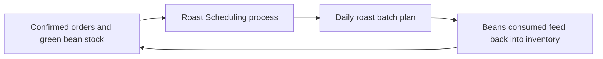

# Lecture 1 — What Is an Information System?

> **Duration:** ~2 hours. **Outcome:** You can give a precise, non-circular definition of an information system, explain the input→process→output→feedback loop, name a system's boundary and environment, and explain — with examples — why "information system" is not a synonym for "computer" or "software."

## 1. The wrong definition, and why it's wrong

Ask most people "what's the information system here?" and they point at a screen — the POS terminal, the app, the dashboard. That's understandable and it's wrong. The screen is **technology**, one of four components. The information system is the whole loop: a person does something, following some process, that touches some data, carried by some technology.

Proof this is true: information systems existed for thousands of years before computers did. A few that predate any electronics:

- A ship captain's **log book** — an entry made after every watch (process), by the officer on duty (people), recording position, weather, and incidents (data), on paper in a bound ledger (technology).
- A library's **card catalog** — a librarian (people) files a card (technology) for every new book, following a strict rule for how titles are alphabetized (process), so a patron can find any book by author or subject (data, organized for retrieval).
- A restaurant's **order pad and kitchen bell** — a server (people) writes an order (data) on a pad (technology), following a rule about which items go on which line (process), and rings a bell to signal the kitchen (a crude but real feedback signal).

None of these have a computer in them. All of them are complete, working information systems. Computers didn't invent the concept — they made an existing one faster, cheaper to run at scale, and easier to search. Keep that straight and the rest of this course makes a lot more sense: **when this course later says "system," it never means just the software.**

## 2. A working definition

> **An information system is an organized combination of people, process, data, and technology that collects, processes, stores, and distributes information to support decisions, coordination, and control in an organization.**

Unpack that sentence — every word is load-bearing:

- **Organized** — not random. The components exist in a deliberate arrangement, even if nobody ever wrote it down. (Part of your job all course long is to *make it* written down.)
- **Combination of people, process, data, and technology** — all four, together. Remove any one and you don't have a smaller information system, you have a broken one. A brilliant database with nobody trained to use it is not a working system. A well-trained team with no data to work from is not a working system either.
- **Collects, processes, stores, and distributes** — an information system is not static. It has a lifecycle: information comes in, gets transformed, gets kept somewhere, and gets sent to whoever needs it next.
- **To support decisions, coordination, and control** — this is the *point*. An information system that produces information nobody acts on has failed at its actual job, no matter how elegant its technology. You'll return to this exact idea in Lecture 3 under "value."

## 3. The systems-theory skeleton: input → process → output → feedback

Every information system, no matter how small or how large, has the same four-part shape borrowed from general systems theory:

```
   INPUT  ──────▶  PROCESS  ──────▶  OUTPUT
     ▲                                  │
     │                                  │
     └──────────── FEEDBACK ◀───────────┘
```

- **Input** — raw data entering the system: a wholesale order called in, a bag of green coffee delivered, a customer's card swipe.
- **Process** — the transformation applied to that input: validating the order, roasting the beans, authorizing the charge.
- **Output** — the result leaving the system: a confirmed order record, a roasted batch ready to bag, a completed sale.
- **Feedback** — output that gets routed back in to adjust future behavior: this week's sell-through rate changing next week's roast plan; a customer complaint changing how orders get confirmed.

Feedback is the piece people forget, and it's the one that separates a system from a one-shot script. A system that has input, process, and output but **no feedback loop** cannot improve or self-correct — it just keeps doing the same thing regardless of whether the output is any good. You'll see this exact gap in Challenge 1, when Riverbend's pre-register process turns out to have almost no feedback at all.

**Worked example — Riverbend's roast scheduling:**

- *Input:* confirmed wholesale/subscription order quantities, plus current green-bean stock.
- *Process:* the Roast Scheduling process (component `6` in your `is_components` table) turns that into a daily batch plan.
- *Output:* a roast batch plan handed to the Head Roaster.
- *Feedback:* the actual beans consumed per batch (from the Roast Batch Log) get deducted back into Green Coffee Inventory — so tomorrow's scheduling input reflects today's real consumption, not yesterday's guess.


*Riverbend's roast-scheduling loop — today's consumption becomes tomorrow's input.*

Run the sanity-check query from the README and look at flows `4`–`6` and `9` in `is_flows` — that's this exact loop, already sitting in your database:

```sql
SELECT f.flow_id, s.name AS source, t.name AS target, f.data_exchanged, f.frequency
FROM is_flows f
JOIN is_components s ON s.component_id = f.source_component_id
JOIN is_components t ON t.component_id = f.target_component_id
WHERE f.flow_id IN (4, 5, 6, 9)
ORDER BY f.flow_id;
```

*(That query uses a `JOIN` — a Week 2/3 topic. If it's unfamiliar, ignore the SQL for now and just read the four rows of the seed data directly; the loop is visible either way. You are not expected to write joins this week.)*

## 4. Boundary and environment

Every system has a **boundary** — the line that separates "inside the system" from "outside it, but still relevant." Everything outside the boundary that still affects the system is its **environment**.

- Riverbend's information system's boundary includes: its staff, its roast/order/ship processes, its inventory and order data, its POS and portal software.
- Riverbend's **environment** — outside the boundary, but very much still shaping it — includes: green coffee suppliers, shipping carriers, the bank that processes card payments, competing roasters, and customers themselves.

Why this distinction matters in practice: when something goes wrong, the first diagnostic question is *"did this break inside the boundary (something we control) or in the environment (something we don't)?"* A carrier delay is an environment problem — you can build a process to handle it (notify the customer), but you can't fix the carrier. A wholesale order double-booking the same batch of beans is a boundary problem — that's yours to fix, and it's exactly the kind of thing Challenge 1 asks you to diagnose.

Boundaries are also a **design choice**, not a law of nature. You could draw Riverbend's system boundary tighter (just the roastery) or wider (include the bean farms it buys from). Where you draw it changes what counts as "input from the environment" versus "an internal process step." There's no universally correct boundary — there's only a boundary that's useful for the question you're trying to answer, and part of doing this work well is being explicit about where you drew yours.

## 5. Information system vs. information technology — the distinction that matters for your career

These two terms get used interchangeably in casual conversation and that sloppiness costs people real money and real outages. Pin the difference down:

| | Information System (IS) | Information Technology (IT) |
|---|---|---|
| **What it is** | The whole people+process+data+technology loop | Just the technology component — hardware and software |
| **Example** | "How Riverbend takes and fulfills a wholesale order" | "The Square POS terminal" or "the PostgreSQL database" |
| **Fails when** | Any of the four components breaks, or a flow between them is missing | The hardware/software breaks |
| **Fixed by** | Redesigning process, retraining people, fixing data quality, upgrading technology — whichever is actually broken | Patching, upgrading, or replacing technology |

The costly mistake: treating every IS problem as an IT problem. If wholesale orders keep double-booking the same beans, buying better software will not fix it if the real gap is that two people update two different lists and never compare notes — that's a **process** and **data** problem wearing a technology costume. This course trains you to diagnose which component actually broke before you reach for a technology fix. You'll practice this directly in Challenge 1.

## 6. Meet Riverbend Coffee Roasters

The company you'll use as this week's running example: **Riverbend Coffee Roasters**, a small company that:

- **Roasts** green coffee beans into finished, roasted coffee (Production).
- **Sells** drinks and bags of beans over a retail counter (Retail).
- **Ships wholesale** orders to cafés and grocery stores that resell Riverbend's coffee (Wholesale).
- **Fulfills** both wholesale and subscription orders from a small warehouse (Fulfillment).
- **Runs a subscription** — customers get a bag shipped to their door on a recurring schedule (Digital).

Five people, five processes, five data items, five pieces of technology — twenty components already sitting in your `is_components` table, and nineteen flows already in `is_flows`, all seeded by the README. You didn't invent this system; you're about to learn to *read* it, extend it, and eventually diagnose what's wrong with it.

## 7. Check yourself

- In your own words, why is "the information system" not the same thing as "the software"?
- Name the four parts of the input→process→output→feedback loop, and give one Riverbend example of each.
- What happens to a system that has input, process, and output, but no feedback loop?
- Define "boundary" and "environment" in one sentence each, and give one example of each for Riverbend.
- A wholesale order gets double-booked against beans that were already promised to another order. Is that most likely an IS problem or an IT problem? Defend your answer.
- Give one example of an information system — real, from your own life — that has no computer in it at all.

If those are automatic, Lecture 2 goes component-by-component into people, process, data, and technology — including where beginners most often misclassify something.

## Further reading

- **NIST — "information system" (glossary definition, official U.S. government standard):** <https://csrc.nist.gov/glossary/term/information_system>
- **Wikipedia — Systems theory (input/process/output/feedback origins):** <https://en.wikipedia.org/wiki/Systems_theory>
- **Wikipedia — Information system (component overview):** <https://en.wikipedia.org/wiki/Information_system>
