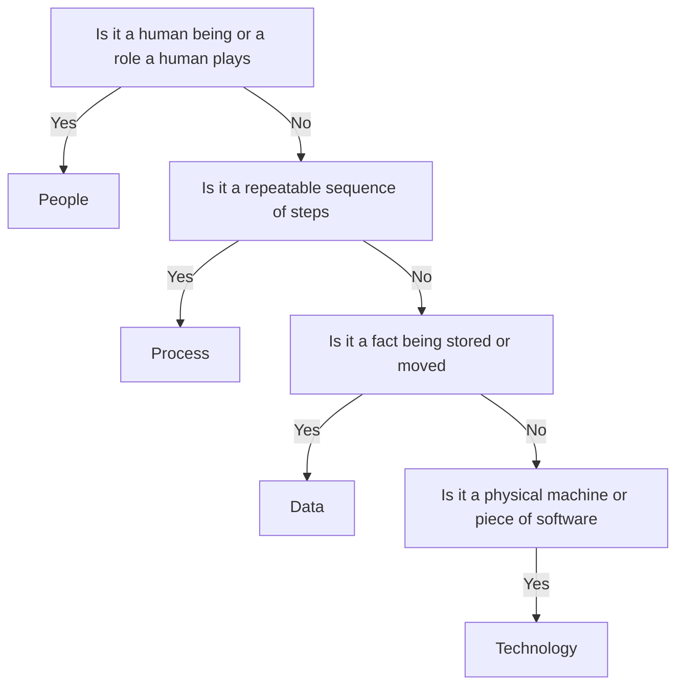

# Lecture 2 — People, Process, Data, Technology

> **Duration:** ~2 hours. **Outcome:** You can classify any real-world item into exactly one of the four components, explain the classic five-component model this course simplifies from, avoid the three most common beginner misclassifications, and insert/query rows in the `is_components` SQL register from memory.

Lecture 1 gave you the shape of a system. This lecture takes apart the four pieces that fill that shape, one at a time, with Riverbend examples for each — and shows you exactly where beginners get the classification wrong, because that's the actual skill being tested here, not the definitions themselves.

## 0. A note on the five-component model

Some textbooks split this course's "technology" into two: **hardware** (physical machines — the roaster, the scanner, the card reader) and **software** (the programs that run on them — the roast-profile controller, the POS app). That's the classic **five-component model**: people, process/procedures, data, software, hardware.

This course groups hardware and software into one bucket, **technology**, because for the level you're working at this week the distinction rarely changes the decision you're making. If you ever need the finer split — say, when you're doing a hardware refresh budget in a later week — just subdivide `technology` into `hardware` and `software` at that point. Nothing about the register schema stops you; `category` is a plain text column, not a fixed enum.

## 1. People

**People** are the humans who do work in the system — operating technology, following (or bending) processes, creating and consuming data, making the judgment calls no process anticipated.

Riverbend's five people, already in your `is_components` table:

| Name | Role | Department |
|---|---|---|
| Elena Vasquez | Head Roaster | Production |
| Devon Park | Barista Lead | Retail |
| Ruth Okafor | Wholesale Account Manager | Wholesale |
| Sam Higgins | Warehouse Packer | Fulfillment |
| Nora Chen | Owner / General Manager | Leadership |

Note what's classified as **people** and what isn't:

- A **person** (Elena) is people. Her **job title** ("Head Roaster") is a label describing a person, not a separate component. Don't double-count it.
- A **role a customer plays** (placing a wholesale order) is also people — customers are participants in the system even though they're outside the organization's payroll. Riverbend's environment (Lecture 1) includes people who aren't employees.
- A **team or department** ("Wholesale") is not itself a people-component row — it's an attribute (the `department` column) describing where a person, process, or piece of data lives. Don't create a row for "the Wholesale team"; create rows for the actual people and processes inside it.

**Common beginner mistake:** classifying a *decision* someone makes ("Nora decides which wholesale orders to approve") as a process. The **decision itself is not a process** — it's an action a person takes, informed by data, possibly following a process that tells her how. If you want to model "how Nora approves orders," that's a process (`Order Approval`); Nora herself stays a people-row.

## 2. Process

**Process** is a repeatable sequence of steps that transforms an input into an output — the "how" of the system. A process can be followed by a person, executed by technology, or (usually, and this is the point of the whole course) some of both.

Riverbend's five seeded processes:

| Name | What it does | Department |
|---|---|---|
| Roast Scheduling | Turns demand into a daily roast plan | Production |
| Order Intake | Captures a wholesale order | Wholesale |
| POS Checkout | Rings up a retail sale | Retail |
| Pick-Pack-Ship | Fulfills a wholesale/subscription order | Fulfillment |
| Subscription Renewal | Auto-charges and re-ships a recurring order | Digital |

Test for "is this really a process": can you write it as **a numbered list of steps that happens the same way (roughly) every time**? If yes, it's a process. If the "steps" change unpredictably based on who's doing it and their mood that day, you don't have a process yet — you have chaos wearing a process's name, and that's exactly the kind of gap Challenge 1 asks you to find.

**Common beginner mistakes:**

- Confusing a process with the **technology** that automates it. "The Wholesale Order Portal" is technology (a piece of software). "Order Intake" — the sequence of steps that happens when an order arrives, whether by portal, phone, or email — is the process. The portal is *one possible way* the process happens; the process is bigger than any single technology that implements it. Proof: Order Intake still happens (via phone/email) even for wholesale customers who never touch the portal — flow `1` in your seed data (Ruth → Order Intake) has nothing to do with the portal at all.
- Confusing a process with an **event**. "A customer places an order" is an event (something that happened at a point in time) that *triggers* a process. The event isn't the process; the sequence of steps Riverbend runs in response is.

## 3. Data

**Data** is the raw facts a system collects, stores, and moves — the "what" being acted on. (Lecture 3 draws a sharp line between raw *data* and processed *information*; for now, treat "data" as anything captured and stored.)

Riverbend's five seeded data items:

| Name | What it holds | Owning department |
|---|---|---|
| Green Coffee Inventory | Unroasted bean stock by origin/quantity | Production |
| Roast Batch Log | Time/temp/weight-loss per batch | Production |
| Customer Order | Wholesale/subscription order details | Wholesale |
| POS Transaction | An itemized retail sale | Retail |
| Delivery Manifest | Carrier + tracking + contents per shipment | Fulfillment |

**Common beginner mistakes:**

- Classifying the **table that stores the data** as the data itself, when it's really the **technology** holding it. "The Customer Order" (the fact of an order — items, quantities, ship-to) is data. "The database it's stored in" is technology. This distinction matters enormously once you get to Week 3 (data modeling) — you're about to design the tables that *hold* data, and confusing the data with its container is the single most common mistake in that week too.
- Treating a **report** as data rather than a downstream *output* of a process applied to data. "Daily retail sales summary" (flow `12` in your seed) is technically derived data — information, really — produced by summarizing many POS Transaction rows. It's fine to model it as its own data component once it's a distinct, stored thing people rely on (which is exactly what flow `12` does), but be conscious that it's one hop removed from the raw transactions it's built from.

## 4. Technology

**Technology** is the hardware and software that carries, stores, transforms, or displays data and executes automated parts of a process.

Riverbend's five seeded technology components:

| Name | What it is | Department |
|---|---|---|
| Roast Profile Controller | Drives the roaster's heat/airflow curve | Production |
| Square POS Terminal | Card-swipe register | Retail |
| Wholesale Order Portal | Web form for repeat orders | Wholesale |
| Warehouse Scanner | Confirms picked items match the order | Fulfillment |
| Subscription Billing Platform | Recurring-charge engine | Digital |

**Common beginner mistake:** classifying a **spreadsheet** as harmless "technology," full stop, with no further scrutiny. A spreadsheet *is* technology — but an **uncontrolled, shared spreadsheet used as the system of record** is a specific, well-known anti-pattern this course names explicitly: no access control, no audit trail (who changed what, when), no way to guarantee two people don't overwrite each other's edit at the same moment, no enforced structure (nothing stops someone typing "in transit" in one cell and "In Transit" in the next). That's exactly why this course's data rule bans spreadsheets as a data store and puts everything — starting with the register you're editing right now — in real, constrained SQL tables instead. You'll see the concrete cost of this anti-pattern in Challenge 1, where Riverbend's pre-register wholesale process ran on precisely this kind of spreadsheet.

## 5. Putting it in the register: SQL you already have the tools for

You don't need anything beyond `INSERT`, `SELECT`, and `WHERE` this week. Two examples against your seeded table:

**Add a new component** — Riverbend just hired a bookkeeper:

```sql
INSERT INTO is_components (component_id, category, name, description, department)
VALUES (21, 'people', 'Priya Shah', 'Bookkeeper — reconciles daily sales and pays suppliers', 'Finance');
```

**Query by category** — every piece of technology in the system:

```sql
SELECT name, department FROM is_components WHERE category = 'technology' ORDER BY department;
```

**Query by department** — everything touching Fulfillment:

```sql
SELECT category, name FROM is_components WHERE department = 'Fulfillment' ORDER BY category;
```

That's the whole toolkit for Exercise 1. The classification judgment — not the SQL syntax — is this lecture's actual point.

## 6. A fast classification checklist

When you're unsure which bucket something belongs in, ask in this order:

1. **Is it a human being (or a role a human plays)?** → people.
2. **Is it a repeatable sequence of steps?** → process.
3. **Is it a fact being stored or moved — a record, a count, a log entry?** → data.
4. **Is it a physical machine or a piece of software?** → technology.

If two answers seem to fit, you're probably looking at two components tangled together (e.g., "the spreadsheet the sales team uses to track orders" = technology **and** an implied, informal process for how it gets updated). Split it. Modeling each component separately — even when they're always mentioned together in conversation — is what makes the register useful instead of just a copy of how people already talk about the system.


*The four-question checklist for classifying any real-world item into exactly one component.*

## 7. Check yourself

- Explain, with a Riverbend example, why "Wholesale Order Portal" is technology but "Order Intake" is a process.
- A customer's decision to reorder is an event. What process does it trigger at Riverbend?
- Why is an uncontrolled shared spreadsheet a technology-category item *and* a red flag at the same time?
- Write the `INSERT` statement to add a new data component: "Supplier Invoice" — records what Riverbend owes a green-coffee supplier — owned by Finance.
- Write the `SELECT` to list every **process** in the Wholesale or Digital departments.
- Classic five-component model: which two of this course's four categories does it split apart, and why doesn't that split matter much at this course's level?

If those are automatic, Lecture 3 explains what actually turns this raw inventory of components into *value* for the business — and what happens when it doesn't.

## Further reading

- **Wikipedia — Five-component framework of information systems:** <https://en.wikipedia.org/wiki/Information_system#Five-component_framework>
- **PostgreSQL — "Populating a database" (`INSERT` basics):** <https://www.postgresql.org/docs/current/populate.html>
- **SQLite — `INSERT` syntax:** <https://www.sqlite.org/lang_insert.html>
