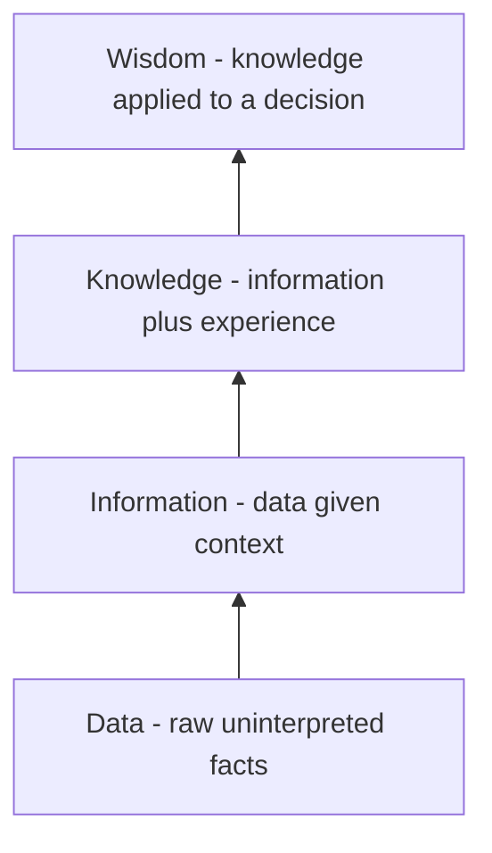

# Lecture 3 — How Information Systems Create Value

> **Duration:** ~2 hours. **Outcome:** You can walk raw data up the DIKW pyramid to a decision, explain the difference between efficiency and effectiveness, locate a process on a value chain as primary or support, and diagnose in concrete terms how a missing flow destroys value rather than just being "inconvenient."

Lecture 1 defined the system. Lecture 2 named its parts. This lecture answers the question that actually justifies the whole course existing: **why do organizations spend money and attention on this?** The honest answer is not "because it's modern" — it's that a well-built information system creates measurable value, and a badly built one destroys it just as measurably. You need to be able to say *which* and *why*, in plain language, to a non-technical stakeholder — because you'll be asked to, starting next week.

## 1. Data → Information → Knowledge → Wisdom (the DIKW pyramid)

Raw data is not automatically useful. It has to climb a ladder before it changes what anyone does:

| Layer | What it is | Riverbend example |
|---|---|---|
| **Data** | Raw, uninterpreted facts | A single POS Transaction row: `2026-06-12 14:03, 1 bag Ethiopia Yirgacheffe, $18.50, card` |
| **Information** | Data given context — organized, summarized, or compared | "Retail sold 340 bags in June, up 12% from May" |
| **Knowledge** | Information combined with experience to explain *why* | "The June bump lines up with the new cold-brew menu item that uses that bean" |
| **Wisdom** | Knowledge applied to a specific future decision | "Increase Ethiopia Yirgacheffe roast allocation by 15% for July, and brief Wholesale that cold-brew demand may pull inventory from their allocation too" |

Two things matter about this ladder more than memorizing the four labels:

**First — each step up requires a process, and that process is exactly what half of this course's remaining weeks are about.** Data doesn't turn into information by itself; someone (or something automated) has to aggregate it, and that aggregation *is a process* in the Lecture 2 sense. No process, no climb. This is why "we have a ton of data" is not the same claim as "we have information," and why a company can be simultaneously data-rich and insight-poor — precisely the failure mode Week 10 (Analytics & Business Intelligence) exists to fix.

**Second — most of the value in an information system is created at the top of the ladder, not the bottom.** A single POS Transaction row, by itself, is nearly worthless — nobody changes a single decision because of it. The *decision* to shift July's roast allocation is where the actual money is. Keep this in mind every time you're tempted to treat "we're collecting the data" as the finish line. It's the starting line.


*Each step up the DIKW pyramid requires a process — nothing climbs on its own.*

## 2. Value chain: primary vs. support activities

Michael Porter's **value chain** model splits an organization's activities into two kinds:

- **Primary activities** — directly create the product or service the customer pays for: inbound logistics (getting green coffee in), operations (roasting), outbound logistics (shipping), marketing/sales (winning wholesale accounts, running the café), service (handling complaints, subscription support).
- **Support activities** — don't touch the product directly, but make the primary activities possible: infrastructure (the SQL register itself, finance, management), HR, technology development, procurement.

Map Riverbend's seeded components onto this:

| Value chain activity | Riverbend example (component in your register) |
|---|---|
| Inbound logistics | Green Coffee Inventory (data) |
| Operations | Roast Scheduling, Elena Vasquez, Roast Profile Controller |
| Outbound logistics | Pick-Pack-Ship, Sam Higgins, Warehouse Scanner |
| Marketing & sales | Order Intake, Ruth Okafor, Wholesale Order Portal |
| Service | *(not yet in the seed — you'll add it in Exercise 1 / Challenge 1)* |
| Support: infrastructure | Nora Chen, the `is_components`/`is_flows` register itself |

Why this matters practically: when a stakeholder asks "should we invest here?", the value chain gives you a fast first filter. Investment in a **primary** activity usually shows up directly in revenue or cost of goods (a faster roaster, a better wholesale portal). Investment in a **support** activity shows up indirectly, as capacity to run the primary activities well (a better register, better accounting) — real value, but a different, longer-cycle argument to make to a budget owner. Confusing the two is a common way a good idea gets rejected for the wrong reason.

## 3. Efficiency vs. effectiveness — two different failure modes

These get used as synonyms in casual speech. They are not the same axis, and mixing them up leads to fixing the wrong problem:

- **Efficiency** — doing the thing with the least waste (time, money, effort). *"How fast can Order Intake process a wholesale order?"*
- **Effectiveness** — doing the *right* thing at all, regardless of speed. *"Does the order we processed actually match what the customer needed?"*

A system can be efficient and ineffective at the same time — and this combination is more dangerous than either failure alone, because it *feels* like success. Picture Order Intake processing a wholesale order in 90 seconds flat (highly efficient) — but confirming a delivery date the warehouse can't actually hit, because Order Intake never checked Green Coffee Inventory before promising (badly ineffective). The speed metric looks great in a status report right up until the customer complaint arrives. When you diagnose a broken system in Challenge 1, name **both** axes explicitly — a fix that only improves speed can make an ineffective process fail faster.

## 4. Where value is created — and where it's destroyed

Trace one flow end-to-end and value creation becomes concrete rather than abstract. Take Riverbend's roast-to-inventory loop (flows `8`–`9` in your seed data):

```
Roast Profile Controller ──(readings)──▶ Roast Batch Log ──(consumption)──▶ Green Coffee Inventory
```

**Value created:** because consumption flows back into inventory automatically, tomorrow's Roast Scheduling (flow `5`) works from real numbers, not a stale estimate. That means Riverbend doesn't over-roast (wasting beans and cash) or under-roast (missing a wholesale delivery date). The *flow itself* — not either endpoint alone — is where the value lives. This is the single most important idea in this lecture: **value in an information system usually lives in the connections between components, not in the components themselves.** A brilliant Roast Batch Log that never flows back into Inventory has almost the same practical value as no log at all.

**Now delete that flow and watch value get destroyed, step by step:**

1. Roast Batch Log still records exactly what was consumed — the data still exists.
2. But nobody, and nothing, moves that number back into Green Coffee Inventory.
3. Inventory now silently drifts from reality — it thinks Riverbend has more beans on hand than it does.
4. Roast Scheduling (which reads Inventory) plans tomorrow's batches against a number that's wrong.
5. Some day, a batch gets scheduled that the actual bean stock can't cover — discovered only when Elena goes to pull the beans.
6. That day's wholesale orders slip a day. A customer complains. Ruth has to apologize and can't explain why, because from where she sits, nothing looks broken — the data she can see (Customer Order) was always correct.

Nothing in that chain required a technology failure, a person being careless, or a process being poorly written in isolation. **A single missing flow was enough to eventually cause a real, customer-facing failure days or weeks later**, and — this is the sharp part — nobody could see it coming by inspecting any single component. You had to look at the connection. This is exactly the habit Challenge 1 asks you to practice: stop asking "which component broke?" and start asking "which flow is missing, and what silently drifts because of it?"

## 5. A quick worked value argument (the pattern you'll use starting Week 2)

Stakeholders don't want a component diagram — they want to know **what it's worth to fix something**. Here's the compressed pattern:

> "Right now [gap: batch consumption doesn't flow back into inventory]. That means [consequence: inventory numbers drift from reality]. Eventually that causes [business impact: a batch gets scheduled the stock can't cover, and a wholesale delivery slips]. Fixing it costs [effort: one new flow, roughly a day of work] and prevents [value: an estimated 2–3 missed deliveries per quarter, each risking a wholesale account]."

You'll write arguments in exactly this shape all course long — it's the backbone of a requirements justification in Week 2 and a security/governance case in Week 9. Get comfortable with the gap → consequence → impact → cost → value chain now.

## 6. Check yourself

- Walk one Riverbend example all the way up the DIKW pyramid: state the raw data, the information, the knowledge, and the wisdom/decision.
- Why does "we're collecting the data" not mean "we have information"?
- Classify Riverbend's Pick-Pack-Ship process as a primary or support value-chain activity, and justify it.
- Describe a real (or plausible) situation where a process is efficient but not effective. What's the risk of only measuring efficiency?
- In the roast-to-inventory example, which specific component broke? *(Trick question — walk through why the honest answer is "none of them, individually.")*
- Using the gap → consequence → impact → cost → value pattern, write a two-sentence argument for adding a Customer Service flow that Riverbend doesn't have yet.

If those are automatic, you're ready for this week's exercises — they put every one of these ideas directly into the SQL register.

## Further reading

- **Wikipedia — DIKW pyramid:** <https://en.wikipedia.org/wiki/DIKW_pyramid>
- **Investopedia — Porter's Value Chain:** <https://www.investopedia.com/terms/v/valuechain.asp>
- **Wikipedia — Efficiency vs. effectiveness:** <https://en.wikipedia.org/wiki/Effectiveness>
