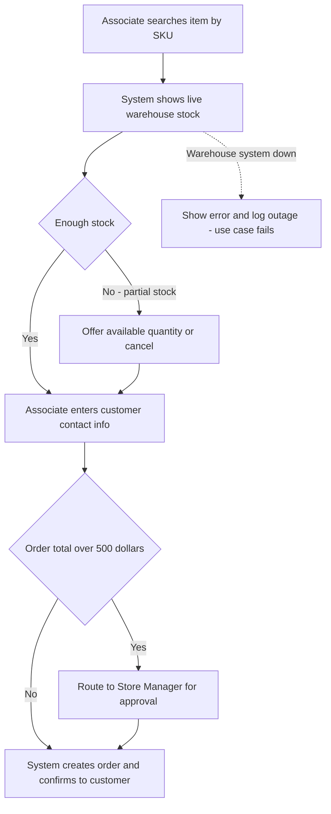
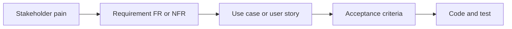

# Lecture 3 — Use Cases & User Stories

> **Duration:** ~2 hours. **Outcome:** You can model system behavior with actors and a full use-case specification (main flow, alternate flows, exception flows), write user stories in `As a / I want / so that` form that pass the INVEST test, and attach Given/When/Then acceptance criteria precise enough for someone else to verify without asking you anything.

Lecture 2 gave you requirement *statements*. This lecture gives you two complementary ways to model *behavior* — what actually happens, step by step, when a person uses the system. **Use cases** and **user stories** answer the same underlying question at different altitudes: a use case is the detailed contract for one interaction, a user story is the lightweight backlog unit a team plans a sprint around. You need both skills; most real teams use both artifacts on the same project.

## 1. Actors — who (or what) interacts with the system

An **actor** is any person, role, or external system that interacts with the system to accomplish a goal. Actors are not job titles from an org chart — they're *roles relative to the system*. The same person can be two actors at different times (Dana is a "Store Manager" actor when approving an order, and just an "Associate" actor when placing one herself).

Meridian's special-order system has these actors:

- **Store Associate** — places orders, checks status.
- **Store Manager** — approves orders above a threshold, views store-level reports.
- **Warehouse Fulfillment Clerk** — confirms stock, marks orders picked/shipped.
- **Customer** — receives status updates (usually a *secondary* actor — doesn't operate the system directly, but the system acts on their behalf).
- **Notification Service** (external system) — sends the SMS/email; the special-order system is a *client* of this actor, not its operator.

Drawing the actor list before writing a single use case forces a useful question: **is this actor primary (initiates the interaction) or secondary (participates but doesn't start it)?** Getting that backwards is a common source of a use case that reads clearly but models the wrong trigger.

## 2. Use cases — the full contract for one interaction

A **use case** describes, in detail, how a primary actor achieves one specific goal using the system — including what happens when things don't go perfectly. It has a standard shape:

```
Use Case: UC-01 — Place a Special Order
Primary Actor: Store Associate
Goal: Order an out-of-stock item for a customer with a reliable delivery estimate
Preconditions: Associate is logged into the store system; customer is present or on the phone
Trigger: Customer requests an item not in the store's on-hand inventory

Main Success Scenario:
  1. Associate searches for the item by SKU or name.
  2. System displays the item's live warehouse stock quantity.
  3. Associate confirms quantity is available and enters the customer's name and
     contact method (phone or email).
  4. System calculates an estimated delivery date based on warehouse lead time.
  5. Associate reviews the estimate with the customer and confirms the order.
  6. System creates the order, assigns it a status of "placed," and sends the
     customer a confirmation with the estimated date.
  7. Use case ends in success.

Alternate Flows:
  3a. Requested quantity exceeds warehouse stock:
      3a1. System displays the maximum available quantity.
      3a2. Associate offers the customer the available quantity, or cancels.
           Return to step 3.
  5a. Order total exceeds $500:
      5a1. System routes the order to the Store Manager for approval
           before step 6 proceeds. See UC-02 (Approve High-Value Order).

Exception Flows:
  2a. Warehouse system is unreachable:
      2a1. System displays "stock unavailable — try again" and logs the outage.
      2a2. Use case ends in failure; associate may retry or call the DC as a
           documented fallback.

Postconditions (success): An order record exists with status "placed," linked to
  a customer contact method and an estimated delivery date; the customer has
  received a confirmation.
```


*Main success scenario for Place a Special Order, with its alternate stock and approval branches and its exception path.*

A few things worth noticing about that shape:

- **The main success scenario reads like a script** — numbered steps, each one an observable action by the actor or the system. No ambiguity about who does what.
- **Alternate flows** are variations that are still a *legitimate, expected* path — not an error. "Not enough stock" happens routinely; it's not a bug, it's a branch the design has to handle.
- **Exception flows** are failures — something went wrong (a system is down, an input is invalid) — and the use case has to say what happens instead of pretending it can't occur.
- **A use case that only has a main success scenario is unfinished.** The alternate and exception flows are usually where the *real* requirements hide — Priya's $500 approval rule from Lecture 1 shows up here as alternate flow 5a, not as an afterthought bolted on later.

Use cases earn their weight for **complex, multi-actor, multi-branch interactions** — anywhere the "what if" questions multiply. For simpler, single-actor features, the lighter-weight user story (next section) is usually the better tool, which is why real teams keep both in their toolbox rather than picking one dogmatically.

## 3. User stories — the backlog unit

A **user story** is a short, structured statement of a need from one actor's point of view, written to be small enough to plan, build, and demo within a sprint:

> **As a** [actor], **I want** [goal], **so that** [benefit].

```
US-001: As a Store Associate, I want to see live warehouse stock when a
customer asks for an item, so that I can tell them immediately whether it's
available without calling the DC.
```

The three parts do different jobs: the **actor** keeps you honest about whose need this actually is (not "the system," a role); the **goal** is the action; the **benefit** is the *why* — and the benefit is what lets a team make a smart tradeoff later ("we can't build it exactly like this, but does this alternative still deliver the benefit?").

### The INVEST checklist

A good user story is:

- **I**ndependent — can be built and delivered without waiting on another story to finish first (as much as realistically possible).
- **N**egotiable — describes a need, not a locked-in implementation; the *how* is still open for the team to design.
- **V**aluable — delivers something a real actor cares about, not an internal technical step with no visible benefit ("as a developer, I want a database table" is not a user story — it's a task hiding inside one).
- **E**stimable — the team can size it, even roughly, because it's specific enough to reason about.
- **S**mall — fits in a sprint; if it doesn't, split it (see below).
- **T**estable — has acceptance criteria that make "done" an observable fact, not an opinion.

### Splitting a story that's too big

"As a Store Associate, I want to manage special orders" fails **Small** immediately — "manage" is doing an enormous amount of hidden work. Split it by the concrete actions inside it:

- US-001: place a special order
- US-002: view the status of an order I placed
- US-003: cancel an order that hasn't shipped yet
- US-004: search for all open orders for a given customer

Each of those is independently buildable, independently demoable, and independently valuable — the definition of "small" that actually matters, not just "fewer words."

## 4. Acceptance criteria — Given/When/Then

A user story without acceptance criteria is a promise with no way to check it was kept. **Given/When/Then** (Gherkin-style) is the standard shape:

```
Given [the starting state / context]
When  [the actor does something]
Then  [the observable, testable result]
```

Attached to US-001:

```
AC1:
  Given the warehouse has 4 units of SKU JKT-4471 in stock
  When a Store Associate looks up SKU JKT-4471
  Then the system displays "4 available" within 2 seconds

AC2:
  Given the warehouse has 0 units of SKU JKT-4471 in stock
  When a Store Associate looks up SKU JKT-4471
  Then the system displays "0 available" and offers a "notify me when
       restocked" option instead of allowing an order to be placed

AC3:
  Given the warehouse system is unreachable
  When a Store Associate looks up any SKU
  Then the system displays "stock unavailable — try again" and does not
       silently show a stale or zero quantity
```

Notice AC3 exists because Lecture 1's elicitation surfaced the "warehouse system down" case as a real, observed failure mode — acceptance criteria trace back to what you actually learned, not to imagination. A story with only the happy-path criterion (AC1) is exactly as incomplete as a use case with only a main success scenario.

## 5. Use case or user story — which do you reach for?

| Use a **use case** when… | Use a **user story** when… |
|---|---|
| Multiple actors interact in one flow (associate → manager approval → warehouse) | One actor, one clear goal |
| There are many meaningful branches (stock shortage, approval routing, system-down) | The behavior is straightforward enough that Given/When/Then covers it fully |
| You need a durable reference document (contracts, compliance, complex integrations) | You're planning and estimating a sprint's backlog |
| The audience includes non-technical stakeholders who need the full narrative | The audience is the build team, working iteratively |

In practice: **write the use case first for anything genuinely complex** (Place a Special Order, with its approval branch, is a good candidate), then **derive several small user stories from it** for the backlog. UC-01 above decomposes cleanly into US-001 (see live stock), US-005 (place an order under $500), and US-006 (route an order over $500 for manager approval) — one use case, three sprint-sized stories, each traceable back to it.

## 6. Storing stories in SQL

```sql
INSERT INTO user_stories (story_id, actor, wants, benefit, priority, acceptance_criteria, linked_req_id, status)
VALUES
('US-001', 'Store Associate',
 'to see live warehouse stock when a customer asks for an item',
 'I can tell them immediately whether it is available without calling the DC',
 'must',
 'Given 4 units in stock, When associate looks up the SKU, Then system shows "4 available" within 2 seconds.
Given 0 units in stock, When associate looks up the SKU, Then system offers "notify me when restocked" instead of allowing an order.
Given the warehouse system is unreachable, When associate looks up any SKU, Then system shows an explicit error, never a stale or zero quantity.',
 'FR-001', 'draft');
```

Linking `linked_req_id` back to `requirements.req_id` gives you full traceability in one query — from the original stakeholder pain, to the requirement, to the story a developer will actually build:

```sql
SELECT us.story_id, us.wants, r.statement AS traces_to_requirement, s.name AS originally_from
FROM user_stories us
JOIN requirements r ON r.req_id = us.linked_req_id
JOIN stakeholders s ON s.stakeholder_id = r.source_stakeholder_id
WHERE us.story_id = 'US-001';
```


*One traceable chain from a stakeholder's original pain to the code that satisfies it.*

## 7. Check yourself

- What's the difference between a primary actor and a secondary actor? Which is the customer in UC-01, and why?
- Why does an unfinished use case (main flow only) usually hide the most important requirements?
- Rewrite "as a developer, I want a database table for orders" so it passes the **Valuable** test of INVEST — or explain why it can't be fixed and should be a task, not a story.
- Split "as a Store Manager, I want to manage store reports" into at least three smaller stories.
- Write one Given/When/Then acceptance criterion for "cancel an order that hasn't shipped yet."
- When would you write a full use case instead of just a set of user stories?

If those are automatic, you're ready for this week's exercises, where you'll build a real backlog and a real use case set for Meridian — and the challenges, where conflicting stakeholders and an ambiguous one-liner put every skill from all three lectures under real pressure.

## Further reading

- **Alistair Cockburn — "Writing Effective Use Cases" (the canonical reference for use-case structure):** <https://alistair.cockburn.us/get-the-must-have-book-writing-effective-use-cases/>
- **Bill Wake — the original INVEST criteria:** <https://xp123.com/articles/invest-in-good-stories-and-smart-tasks/>
- **Cucumber / Gherkin — Given/When/Then syntax reference:** <https://cucumber.io/docs/gherkin/reference/>
- **Mike Cohn — user story splitting patterns:** <https://www.mountaingoatsoftware.com/agile/user-stories>
