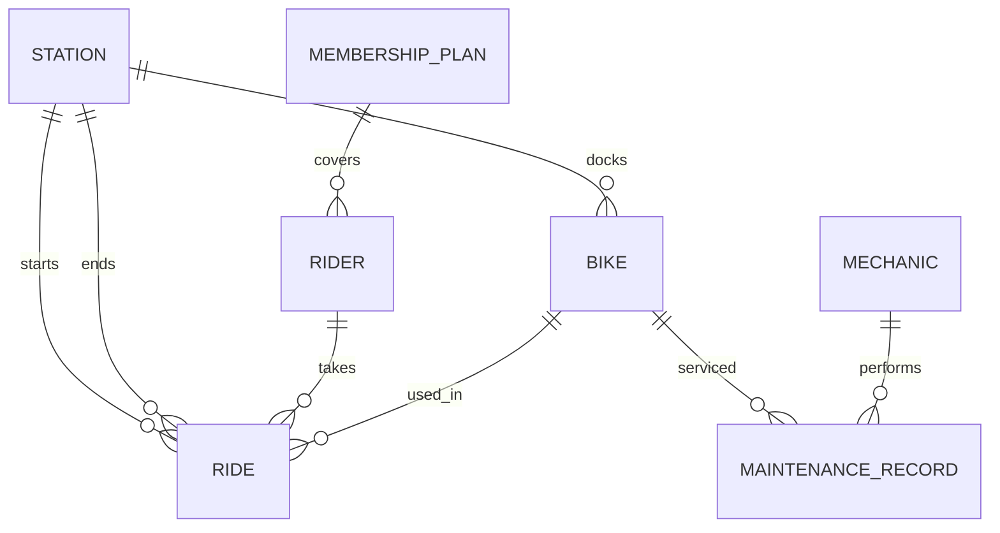

# Lecture 1 — Entity-Relationship Modeling

> **Duration:** ~2 hours. **Outcome:** Given a domain described in plain English, you can identify its entities and attributes, choose primary keys, classify each relationship's cardinality, and draw a correct crow's-foot ER diagram — the artifact every later step this week (normalization, DDL) depends on.

Every information system, no matter how much AI or cloud or automation sits on top of it, is ultimately a promise about **what facts it will remember and how those facts relate to each other**. Before you write one line of SQL, you decide that shape on paper. Get the shape wrong and no amount of clever querying fixes it — you'll be working around a bad model for the life of the system. This lecture is about getting the shape right, using the classic tool for the job: the **entity-relationship (ER) diagram**.

## 1. The case study: CrunchRide

We'll model one domain all week, in increasing detail. Here's the plain-English brief, the kind you'd actually get from a stakeholder:

> "CrunchRide operates docking stations around the city. Each station holds a number of bikes. Riders sign up for a membership plan — Basic, Plus, or Unlimited — and pay for it. A rider takes a ride: unlocks a bike at one station, rides it, and docks it at a station (usually a different one). Bikes need periodic maintenance — a mechanic logs what was done and when. We want to track everything: which rider rode which bike, when, from where to where, and the full maintenance history of every bike."

Read that paragraph twice. It already contains every entity, attribute, and relationship you need — the job is to extract them systematically, not to guess.

## 2. Entities — the "nouns" worth remembering

An **entity** is a distinct *thing* the business needs to track individually, with its own identity, that shows up more than once. Find entities by circling the nouns in the brief and asking: *"does the business need to keep a persistent record of many of these, individually?"*

From the CrunchRide brief:

| Candidate noun | Entity? | Why |
|---|---|---|
| Station | ✅ Yes | Many stations, each individually tracked (location, capacity) |
| Bike | ✅ Yes | Many bikes, each with its own ID and maintenance history |
| Rider | ✅ Yes | Many riders, each with their own account and history |
| Membership plan | ✅ Yes | A small, fixed set (Basic/Plus/Unlimited), but still a thing riders reference and that has its own attributes (price, ride limits) |
| Ride | ✅ Yes | Every individual trip is a record worth keeping — start/end time, station, bike, rider |
| Maintenance record | ✅ Yes | Each service event is its own fact: date, what was done, by whom |
| Mechanic | ✅ Yes | The staff member who performs maintenance |
| "the city" | ❌ No | Never referenced as a thing with its own attributes — it's just scenery |

Six entities, one rejected candidate. That rejection matters as much as the acceptances — **modeling is as much about what you leave out** as what you include. A common beginner mistake is turning every noun into a table; a firmer test is *"would I ever need a second row of this, with its own attributes, that a foreign key could point to?"*

## 3. Attributes — the facts each entity holds

Once you have entities, list their attributes — the individual facts worth storing about each one:

- **Station** — station_id, name, address, capacity (how many docks)
- **Bike** — bike_id, model, status (in service / in maintenance / retired)
- **Rider** — rider_id, first_name, last_name, email, signup_date
- **MembershipPlan** — plan_id, name, monthly_price, ride_minutes_included
- **Ride** — ride_id, bike, rider, start_station, end_station, start_time, end_time
- **MaintenanceRecord** — record_id, bike, mechanic, service_date, description, cost

Notice that some attributes of `Ride` and `MaintenanceRecord` — `bike`, `rider`, `start_station` — are not really *attributes* in the flat sense. They're **references to other entities**. That's your first hint that `Ride` and `MaintenanceRecord` are going to need foreign keys, which we formalize in Lecture 2.

### Picking a primary key for each entity

A **primary key** is the attribute (or minimal set of attributes) that uniquely identifies one row of an entity, forever, and is never `NULL`. You have two real choices:

- **Natural key** — an attribute that already exists in the real world and happens to be unique (an email address, an ISBN, a national ID number).
- **Surrogate key** — a made-up identifier with no business meaning, usually an auto-incrementing integer or a UUID, whose only job is to be a stable, unique handle.

| Entity | Candidate natural key | Problem with it | Chosen key |
|---|---|---|---|
| Rider | email | Riders change email addresses; you'd have to cascade the change everywhere it's referenced | Surrogate `rider_id` |
| Station | name | Two stations could get renamed to the same thing, or a station could be renamed | Surrogate `station_id` |
| MembershipPlan | name ("Basic") | Small, stable, arguably fine as a natural key — but plans do get renamed for marketing | Surrogate `plan_id` |
| Bike | a printed frame serial number | Actually a decent natural key — physically stamped, never changes | Could go either way; we'll use surrogate `bike_id` for consistency |

**Default to a surrogate key unless you have a specific reason not to.** The reason is almost always the same: real-world "unique" identifiers turn out not to be — people change their names, businesses get renamed, government ID formats change across countries, and a primary key that has to change is a primary key that breaks every foreign key pointing at it. A boring auto-incrementing integer never has an opinion about the business and never needs to change.

## 4. Relationships and cardinality

A **relationship** connects two entities and says how many of one can relate to how many of the other. This is where crow's-foot notation earns its keep — it draws the *cardinality* directly into the diagram instead of leaving it to a caption.

### The three shapes

**One-to-one (1:1)** — one row of A relates to at most one row of B, and vice versa. Rare in practice; usually a sign two entities could be one table, or a deliberate split (e.g., a `rider` core table and a separate `rider_billing_details` table kept apart for access-control reasons).

**One-to-many (1:N)** — one row of A relates to many rows of B, but each row of B relates to only one row of A. This is the most common relationship in any schema.

```
Station ||──────∞ Bike
"one station docks many bikes; each bike belongs to (is currently docked at) one station"
```

**Many-to-many (M:N)** — rows of A can relate to many rows of B, and rows of B can relate to many rows of A. This one **cannot** be represented with a single foreign key — it needs a third table (a "junction" or "associative" entity) in between.

```
Rider ∞──────∞ Bike
"a rider rides many bikes over time; a bike is ridden by many riders over time"
```

### Crow's-foot symbols

| Symbol at the end of a line | Meaning |
|---|---|
| `\|` (single bar) | exactly one |
| `O` (circle) | zero (optional) |
| `<` (crow's foot) | many |
| `O<` (circle + crow's foot) | zero or many |
| `\|<` (bar + crow's foot) | one or many |

Read a relationship line from **each end separately** — that's the whole trick to crow's-foot notation. "One `Station` has zero-or-many `Bike`s" is the symbol pair at the `Bike` end (`O<`); "each `Bike` belongs to exactly one `Station`" is the symbol pair at the `Station` end (`||`).

### The CrunchRide relationships, worked out

| Relationship | Cardinality | Reading it |
|---|---|---|
| Station — Bike | 1:N | One station docks zero-or-many bikes; each bike is currently docked at exactly one station |
| Rider — MembershipPlan | N:1 | Many riders can be on the same plan; each rider is on exactly one plan at a time |
| Rider — Ride | 1:N | One rider takes zero-or-many rides; each ride belongs to exactly one rider |
| Bike — Ride | 1:N | One bike is used in zero-or-many rides; each ride uses exactly one bike |
| Station — Ride (×2!) | 1:N, twice | Each ride *starts* at exactly one station and *ends* at exactly one station — two separate foreign keys from `Ride` back to `Station` |
| Bike — MaintenanceRecord | 1:N | One bike has zero-or-many maintenance records; each record is about exactly one bike |
| Mechanic — MaintenanceRecord | 1:N | One mechanic performs zero-or-many maintenance records; each record was performed by exactly one mechanic |

Two things worth flagging:

1. **`Ride` is itself the resolution of a many-to-many relationship.** "A rider rides many bikes, a bike is ridden by many riders" (M:N) becomes concrete once you notice `Ride` is an entity with its own attributes (`start_time`, `end_time`) — it's not just a junction table, it's a real fact worth recording on its own. This is extremely common: what looks like an abstract M:N relationship is often actually a first-class entity once you look at what data it needs to carry.
2. **`Ride` has *two* relationships to `Station`** (start and end). This means two separate foreign key columns (`start_station_id`, `end_station_id`), both pointing at the same `Station` table. Don't let the fact that they reference the same table trick you into thinking it's one relationship — cardinality is about the *meaning* of each connection, and "where a ride started" and "where a ride ended" are two different facts.

## 5. Drawing the diagram

Putting it together (rendered as text — Lecture 3 will translate this straight into DDL):

```
┌─────────────┐        ┌─────────────┐        ┌──────────────┐
│   Station   │ ||───O<│    Ride     │>O───|| │    Station    │
│ station_id  │  docks │  ride_id    │starts  │ (same table,  │
│ name        │        │  bike_id ───┼───┐    │  ends at)     │
│ address     │        │  rider_id   │   │    └──────────────┘
│ capacity    │        │  start_st.. │   │
└──────┬──────┘        │  end_station│   │           ┌──────────────┐
       │ ||            │  start_time │   └──────────>│     Bike      │
       │  docks        │  end_time   │    N:1         │  bike_id      │
       │ O<             └──────┬─────┘                │  model        │
       ▼                       │ N:1                   │  status       │
┌─────────────┐                ▼                       └──────┬────────┘
│    Bike     │        ┌─────────────┐                        │ ||
└─────────────┘        │    Rider    │                        │ O<
                        │  rider_id   │                        ▼
                        │  first_name │                ┌──────────────────┐
                        │  last_name  │                │ MaintenanceRecord│
                        │  email      │                │  record_id       │
                        │  signup_date│                │  bike_id (FK)    │
                        │  plan_id(FK)│                │  mechanic_id(FK) │
                        └──────┬──────┘                │  service_date    │
                               │ N:1                    │  description     │
                               ▼                        │  cost            │
                     ┌───────────────────┐              └────────┬─────────┘
                     │  MembershipPlan   │                       │ N:1
                     │  plan_id          │                       ▼
                     │  name             │              ┌──────────────┐
                     │  monthly_price    │              │   Mechanic    │
                     │  ride_minutes_incl│              │  mechanic_id  │
                     └───────────────────┘              │  first_name   │
                                                          │  last_name    │
                                                          └──────────────┘
```

ASCII only gets you so far — for real work, sketch this on paper or in a tool like [dbdiagram.io](https://dbdiagram.io) (see [resources.md](../resources.md)). What matters is that **every box is an entity with a primary key, every line is a relationship with cardinality marked at both ends, and every foreign key is visible as a line, not buried in a paragraph.**


*The full CrunchRide entity-relationship model — seven entities and their cardinalities.*

## 6. A modeling process you can reuse on any domain

1. Read the domain description once for understanding, once more with a pen, circling nouns.
2. For each circled noun, ask: *"does the business track many of these individually, with their own attributes?"* If yes, it's an entity. If it's really just a property of something else (a bike's *status* is not its own entity — it's an attribute of `Bike`), fold it in.
3. List each entity's attributes, including foreign-key-shaped ones you'll formalize as relationships next.
4. For every pair of entities that reference each other, ask: *"can one A have many B? Can one B have many A?"* — that answers 1:1 / 1:N / M:N.
5. For every M:N relationship, ask: *"is there a fact worth recording about the pairing itself"* (a ride has a start time; a rental has a due date). If yes, that pairing becomes its own entity with two foreign keys. If genuinely no facts attach to the pairing, a plain junction table with just two foreign keys is enough (you'll see one of these in the mini-project).
6. Draw it. Cardinality on every line, at both ends.

Run this process on the library exercise right after this lecture — you'll feel the difference between "reading about ER modeling" and "actually doing it."

## 7. Check yourself

- Why did we reject "the city" as an entity but accept "membership plan," even though CrunchRide only has three plans total?
- What makes `Ride` special — why isn't it just a plain junction table between `Rider` and `Bike`?
- Why does `Ride` need *two* foreign keys to `Station` instead of one?
- Give one reason a surrogate key is usually safer than a natural key, using an example from CrunchRide.
- Draw the crow's-foot symbol pair for "one mechanic performs zero-or-many maintenance records."

If those are solid, Lecture 2 turns this diagram into actual constraints — primary keys, foreign keys, and the normalization theory that tells you *why* the diagram should look like this and not some other, redundant shape.

## Further reading

- **PostgreSQL — "Data Definition" chapter overview:** <https://www.postgresql.org/docs/current/ddl.html>
- **"Crow's Foot Notation" reference (Vertabelo):** <https://academy.vertabelo.com/blog/crow-s-foot-notation/>
- **dbdiagram.io — free browser ER diagramming tool:** <https://dbdiagram.io>
