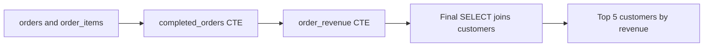
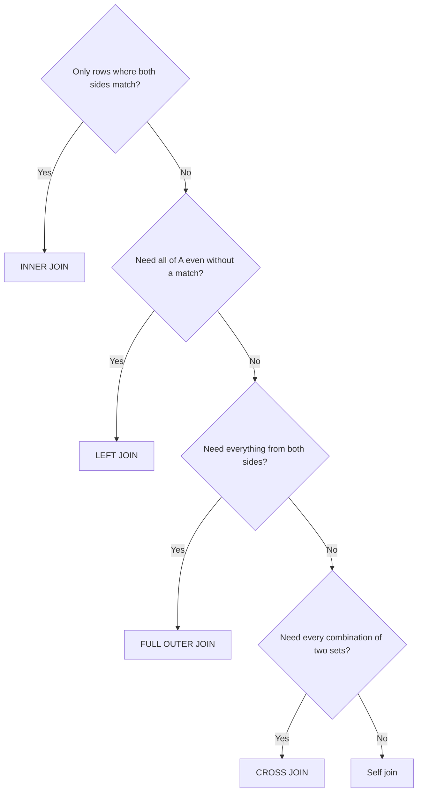

# Lecture 1 — SQL for Business Questions: Joins, Aggregation, and CTEs

> **Duration:** ~2 hours. **Outcome:** given a question in plain English, you pick the right join without guessing, summarize with `GROUP BY`/`HAVING`, and structure multi-step logic with `WITH`.

A normalized schema (Week 3) splits facts across tables on purpose — a customer's city lives once, not once per order. That's correct design, and it means **almost no real question can be answered from one table.** "Which region grew fastest" needs `orders` + `customers` + `regions`. "What's our best-selling product" needs `order_items` + `products`. Every business question this week is really the same skill twice: pull the related rows together (**join**), then summarize them (**aggregate**). Run every query below against the `crunchcycles` schema from the [README setup](../README.md#setup-load-the-week-3-schema) as you read.

## 1. `INNER JOIN` — rows that match on both sides

**Question:** "Show me every order with the customer's company name and the rep who took it."

```sql
SELECT o.order_id, c.company_name, e.first_name || ' ' || e.last_name AS rep, o.order_date, o.status
FROM orders o
JOIN customers c ON o.customer_id = c.customer_id
JOIN employees e ON o.employee_id = e.emp_id
ORDER BY o.order_date;
```

`JOIN` (no qualifier) means `INNER JOIN`: keep a row only if it finds a match in *both* tables on the `ON` condition. Notice the table aliases (`o`, `c`, `e`) — once you join more than one table, every ambiguous column (`order_id` exists nowhere else, but if two tables both had `id`, you'd need to say whose) needs a qualifier, so alias early and alias short.

**The mental model:** an inner join is a *filter*, not just a combine. If a customer had zero orders, they simply never appear in this result — inner join silently drops non-matches. That's correct here (an order always has a customer), but it's the #1 source of "why is my count too low" bugs when the question is really about the *other* side.

## 2. `LEFT JOIN` — keep everything on the left, matched or not

**Question:** "Which customers have never placed an order?"

This is an *absence* question — inner join can't answer it, because it drops exactly the rows you're looking for. `LEFT JOIN` keeps every row from the left table regardless of a match, filling unmatched right-side columns with `NULL`:

```sql
SELECT c.customer_id, c.company_name, o.order_id
FROM customers c
LEFT JOIN orders o ON c.customer_id = o.customer_id
WHERE o.order_id IS NULL;
```

Read it in two steps: the `LEFT JOIN` produces one row per customer, `NULL`-padded when there's no matching order; the `WHERE o.order_id IS NULL` then keeps only the rows where padding happened — i.e., customers with zero orders. This "left join then filter for `NULL`" is called an **anti-join pattern**, and it's how you answer almost every "which X have no Y" business question. Against the seed data this returns customer 18, Fjord Cycling Supply — signed up in January but never ordered.

**A cleaner way to write the same anti-join:** `NOT EXISTS`, which most engines optimize just as well and reads more like English:

```sql
SELECT c.customer_id, c.company_name
FROM customers c
WHERE NOT EXISTS (SELECT 1 FROM orders o WHERE o.customer_id = c.customer_id);
```

Same answer, same idea. Use whichever your team reads faster; know both because you'll see both in the wild.

## 3. `RIGHT JOIN` and why you'll rarely write one

**Question:** "Which reps have zero sales?" — same shape as above, other table:

```sql
SELECT e.emp_id, e.first_name, e.last_name, o.order_id
FROM orders o
RIGHT JOIN employees e ON o.employee_id = e.emp_id
WHERE o.order_id IS NULL;
```

`RIGHT JOIN` keeps everything on the *right* (`employees`) regardless of a match. It works, but almost nobody writes `RIGHT JOIN` in practice — you just swap the table order and use `LEFT JOIN`, which is what your teammates expect to see:

```sql
SELECT e.emp_id, e.first_name, e.last_name, o.order_id
FROM employees e
LEFT JOIN orders o ON o.employee_id = e.emp_id
WHERE o.order_id IS NULL;
```

Same rows, more readable. Against the seed data this returns Maria (the director — not expected to sell) and Priya (a rep with zero orders this period — a real staffing question). **Know `RIGHT JOIN` exists so you can read it; write `LEFT JOIN`.**

## 4. `FULL OUTER JOIN` — keep everything, matched or not, from both sides

**Question:** "Give me one list showing every customer *and* every order, joined where possible, with gaps visible on either side."

```sql
SELECT c.customer_id, c.company_name, o.order_id
FROM customers c
FULL OUTER JOIN orders o ON c.customer_id = o.customer_id
ORDER BY c.customer_id;
```

`FULL OUTER JOIN` is `LEFT JOIN` and `RIGHT JOIN` at once: unmatched rows from *either* side survive, `NULL`-padded on the side that's missing. In this schema every order has a valid customer (a `FOREIGN KEY` guarantees it), so the "right side has no match" half never fires here — but in real, messier data (a legacy export, a system with orphaned rows) `FULL OUTER JOIN` is exactly how you find both "customers with no orders" *and* "orders with no customer" in one query. **SQLite has no `FULL OUTER JOIN`** — emulate it with a `LEFT JOIN ... UNION ... LEFT JOIN` (swap the tables) if you're on SQLite.

## 5. `CROSS JOIN` — every combination, deliberately

**Question:** "I need a row for every (region, month) pair, even months a region sold nothing, so a chart doesn't have a gap."

```sql
SELECT r.region_name, m.month_start
FROM regions r
CROSS JOIN (VALUES ('2024-01-01'::date), ('2024-02-01'::date), ('2024-03-01'::date)) AS m(month_start);
```

`CROSS JOIN` pairs every row on the left with every row on the right — no `ON` condition, because there's nothing to match. 4 regions × 3 months = 12 rows, guaranteed, whether or not a sale happened. This is the standard trick for "fill in the gaps" reporting: build the full grid with `CROSS JOIN`, then `LEFT JOIN` your real data onto it so months with zero sales show `0`, not a missing row. Outside of that pattern, an accidental `CROSS JOIN` — usually from forgetting an `ON` clause — is almost always a bug that multiplies your row count and quietly wrecks a report.

## 6. Self-joins — a table related to itself

**Question:** "List every rep next to their manager's name."

`employees.manager_id` points back into `employees` itself. Join the table to itself under two different aliases:

```sql
SELECT e.first_name || ' ' || e.last_name AS employee,
       m.first_name || ' ' || m.last_name AS manager
FROM employees e
LEFT JOIN employees m ON e.manager_id = m.emp_id
ORDER BY manager, employee;
```

`LEFT JOIN` (not `INNER`) because Maria, the director, has `manager_id = NULL` — an inner self-join would drop her row entirely. Self-joins show up anywhere a table has a "points to another row in the same table" column: org charts, category trees, "previous order by the same customer," bill-of-materials.

## 7. Aggregation — `COUNT`, `SUM`, `AVG`, `MIN`, `MAX`, and `GROUP BY`

**Question:** "How many orders, and how much revenue, per region?"

Aggregation collapses many rows into one summary row per group. `GROUP BY` names the grouping key; the `SELECT` list may then only contain grouped columns and aggregate functions:

```sql
SELECT r.region_name,
       COUNT(*)                              AS order_count,
       SUM(oi.quantity * oi.unit_price)       AS revenue
FROM orders o
JOIN customers c  ON o.customer_id = c.customer_id
JOIN regions r    ON c.region_id  = r.region_id
JOIN order_items oi ON oi.order_id = o.order_id
WHERE o.status = 'Completed'
GROUP BY r.region_name
ORDER BY revenue DESC;
```

Walk the joins first: orders → customers gets you the customer's region; orders → order_items gets you what was actually sold and at what price (order_items.unit_price, not products.unit_price — always trust the transaction table over the catalog table for what was actually charged). `WHERE o.status = 'Completed'` runs **before** grouping — it throws out Cancelled/Pending orders row by row, so they never enter the sums.

**Beware double-counting.** Because this query joins in `order_items` (which can have several rows per order), `COUNT(*)` here actually counts *order line items*, not distinct orders — an order with 2 products counts as 2. If you need a true order count alongside revenue, use `COUNT(DISTINCT o.order_id)`:

```sql
SELECT r.region_name,
       COUNT(DISTINCT o.order_id)             AS order_count,
       SUM(oi.quantity * oi.unit_price)        AS revenue
FROM orders o
JOIN customers c  ON o.customer_id = c.customer_id
JOIN regions r    ON c.region_id  = r.region_id
JOIN order_items oi ON oi.order_id = o.order_id
WHERE o.status = 'Completed'
GROUP BY r.region_name
ORDER BY revenue DESC;
```

This is the single most common join-plus-aggregate bug: joining a "many" table into a summary inflates every plain `COUNT`. Ask yourself, every time: *what does one row of my joined result represent?* Here, one row is one (order, product) pairing — so `COUNT(*)` counts pairings, not orders.

## 8. `HAVING` — filtering *groups*, not rows

**Question:** "Which customers have placed more than 2 completed orders?"

```sql
SELECT c.company_name, COUNT(*) AS order_count
FROM orders o
JOIN customers c ON o.customer_id = c.customer_id
WHERE o.status = 'Completed'
GROUP BY c.company_name
HAVING COUNT(*) > 2
ORDER BY order_count DESC;
```

`WHERE` filters rows **before** grouping happens; `HAVING` filters groups **after** aggregation. You cannot write `WHERE COUNT(*) > 2` — at the point `WHERE` runs, no aggregate has been computed yet. This is the textbook interview question, and now you can answer it with an example: *"`WHERE` removes rows the aggregate never sees; `HAVING` removes summary rows the aggregate already produced."*

| | Runs | Filters | Can reference aggregates? |
|---|---|---|---|
| `WHERE` | before `GROUP BY` | individual rows | no |
| `HAVING` | after `GROUP BY` | groups | yes |

## 9. Common Table Expressions (`WITH`) — naming your steps

**Question:** "Show month-over-month revenue growth for 2024" — a two-step problem: first compute revenue per month, then compare each month to the one before it.

A CTE lets you name an intermediate result and build on it, instead of nesting subqueries into an unreadable knot:

```sql
WITH monthly_revenue AS (
    SELECT DATE_TRUNC('month', o.order_date)::date  AS month_start,
           SUM(oi.quantity * oi.unit_price)          AS revenue
    FROM orders o
    JOIN order_items oi ON oi.order_id = o.order_id
    WHERE o.status = 'Completed'
    GROUP BY DATE_TRUNC('month', o.order_date)
)
SELECT month_start,
       revenue,
       revenue - LAG(revenue) OVER (ORDER BY month_start) AS change_vs_prior_month
FROM monthly_revenue
ORDER BY month_start;
```

(`LAG()` is a window function — Week 10 goes deep on those; here it's just "the value from the previous row," used once to make the CTE example concrete. Don't worry if it's new — the point of this example is the `WITH`, not the window function.)

You can chain CTEs, each building on the last:

```sql
WITH completed_orders AS (
    SELECT * FROM orders WHERE status = 'Completed'
),
order_revenue AS (
    SELECT co.order_id, co.customer_id, SUM(oi.quantity * oi.unit_price) AS revenue
    FROM completed_orders co
    JOIN order_items oi ON oi.order_id = co.order_id
    GROUP BY co.order_id, co.customer_id
)
SELECT c.company_name, SUM(orv.revenue) AS total_revenue
FROM order_revenue orv
JOIN customers c ON c.customer_id = orv.customer_id
GROUP BY c.company_name
ORDER BY total_revenue DESC
LIMIT 5;
```

A CTE is not free performance-wise (Postgres may or may not "inline" it depending on version and query), but it is **always** free *readability*-wise. When a query needs more than one logical step, name each step with `WITH` before you reach for a nested subquery — future-you (and your teammates) will read it top to bottom instead of inside-out.


*Each CTE names one step, so the final query reads top to bottom instead of inside-out.*

## 10. Picking the right join: a decision list

Ask these in order:

1. **Does the question require rows from only where both sides match?** → `INNER JOIN`.
2. **Does the question require "all of A, whether or not it has a B" (or its mirror, "which A have no B")?** → `LEFT JOIN`, possibly `+ WHERE right_key IS NULL` for the anti-join.
3. **Does the question require "everything from both sides, gaps visible on either"?** → `FULL OUTER JOIN`.
4. **Does the question require every combination of two independent sets (a calendar grid, a full matrix)?** → `CROSS JOIN`.
5. **Does the table relate to itself (a manager, a parent category, a previous record)?** → self-join, almost always with `LEFT JOIN` if the "root" row can have `NULL` in the self-referencing column.


*Walking the five questions in order picks the right join without guessing.*

## 11. Check yourself

- Why does `SELECT COUNT(*) FROM orders o JOIN order_items oi ON oi.order_id = o.order_id;` almost never equal the true number of orders?
- Rewrite a `RIGHT JOIN` as a `LEFT JOIN`. What changes?
- Why can't `WHERE` reference `COUNT(*)`?
- What does `LEFT JOIN ... WHERE right_col IS NULL` compute, in one sentence?
- When would you reach for a self-join?
- Why join `order_items.unit_price` for revenue instead of `products.unit_price`?

If those are automatic, Lecture 2 moves the result of queries like these into Python.

## Further reading

- **PostgreSQL — Joins between tables:** <https://www.postgresql.org/docs/current/tutorial-join.html>
- **PostgreSQL — Aggregate functions:** <https://www.postgresql.org/docs/current/functions-aggregate.html>
- **PostgreSQL — `WITH` queries (CTEs):** <https://www.postgresql.org/docs/current/queries-with.html>
- **SQLite — Join clause:** <https://www.sqlite.org/syntax/join-clause.html>
