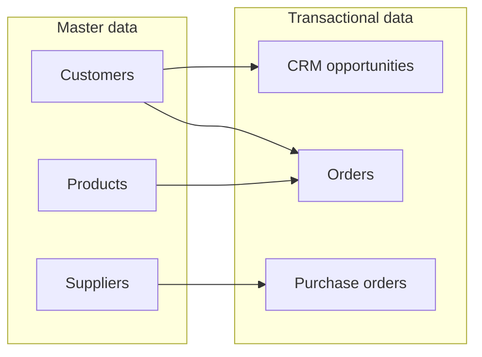

# Lecture 2 — Master Data & the Single Source of Truth

If Lecture 1 taught you the shape of ERP and CRM, this lecture teaches you the concept that determines whether either of them can be *trusted*: **master data**. Get this wrong and it doesn't matter how good your modules are — every report, every automated workflow, every dashboard built on top inherits the rot. This is, without exaggeration, the single most expensive and under-discussed problem in enterprise software. Companies spend tens of millions of dollars on "data cleansing" and "master data management" (MDM) initiatives for exactly this reason.

## 1. Master data vs. transactional data

Every table in an enterprise system falls into one of two categories.

**Master data** describes the *nouns* of the business — the entities that exist independent of any single event, that get referenced over and over, and that change slowly.

- Customers
- Products
- Suppliers/vendors
- Employees
- Chart of accounts (finance categories)
- Locations/warehouses

**Transactional data** describes the *verbs* — events that happen, each one tied to a point in time, each one referencing master data to say who/what/where it involved.

- Sales orders
- Purchase orders
- Invoices
- Shipments
- CRM opportunities
- Payroll runs

In Crunch Cycles' schema:

| Table | Master or transactional? | Why |
|---|---|---|
| `customers` | Master | A company like Trailhead Bikes exists whether or not it's ordering *right now* |
| `products` | Master | "Crunch Trail 100" is the same product across every order it appears in |
| `suppliers` | Master | Taiwan Cycle Works exists as a business relationship independent of any one PO |
| `employees` | Master | Diego Alvarez is a Sales Rep whether or not he closed a deal today |
| `orders` | Transactional | Order #24 happened once, on 2024-03-10, and is done |
| `order_items` | Transactional | Each line existed only inside that one order event |
| `purchase_orders` | Transactional | PO #4 is a specific event: this supplier, this date, this status |
| `crm_opportunities` | Transactional* | Each opportunity is a specific pursuit, tied to one customer and one point in the sales cycle |

*`crm_opportunities` is a defensible edge case — it references master data (`customer_id`, `employee_id`) but is itself an event-with-a-lifecycle, closer to transactional. This is a good example that the line isn't always crisp; what matters is the *reasoning*, not memorizing a fixed list.

**The test that actually works:** ask "if I deleted every transaction tomorrow, would this row still make sense to keep?" A customer, a product, a supplier — yes, obviously, the business relationship or catalog entry still exists. An order — no, an order *is* a transaction; deleting all transactions deletes it by definition.


*Slow-changing master data gets referenced over and over by fast-moving transactional events.*

## 2. Why master data is expensive to get wrong

Transactional data is (relatively) self-correcting: if you enter an order wrong, you see the mistake fast, because the order is wrong *right now* and someone downstream notices. Master data fails silently and compounds:

**Duplication.** Two sales reps, in two different weeks, each create a `customers` row for the same company — one as "Fjord Cycling Supply" and one as "Fjord Cycling Supply Ltd." Now every report that groups by customer under-counts Fjord's true lifetime value, split across two rows. Nobody notices until finance asks "why does our top-20-customers report look wrong" and someone spends a day tracing it back to this.

**Conflicting attributes.** The CRM's contact record says Fjord's primary contact is Oda Berg. The ERP's customer record, entered by someone else, still says the previous contact who left the company two years ago. Which one is right? Neither system knows the other disagrees, because nothing forces them to reconcile.

**Ownership ambiguity.** Who is *allowed* to edit a product's price — sales, finance, or product management? If three teams each think they own the `unit_price` column and each has update access, the value that lands there is whoever wrote last, not whoever was right.

**Referential drift.** A supplier goes out of business. Their row in `suppliers` should be marked `is_active = FALSE`, not deleted (deleting it would break every historical `purchase_order` that references them — you'd lose the ability to say "here's what we bought from them in 2023"). If nobody updates the flag, buyers can accidentally issue a new PO to a supplier who can't fulfill it.

Try it against this week's data:

```sql
-- Suppliers currently flagged inactive would break these POs if deleted instead of flagged
SELECT po.po_id, po.supplier_id, s.supplier_name, s.is_active
FROM purchase_orders po
JOIN suppliers s ON s.supplier_id = po.supplier_id
WHERE s.is_active = FALSE;
```

(Every supplier in this week's seed is active — run it anyway to see the pattern; then imagine flipping `Taiwan Cycle Works` to `FALSE` and consider what would happen to POs 1 and 6 if you'd `DELETE`d the row instead.)

## 3. The single source of truth (SSOT)

The fix the industry converged on is a discipline, not a tool: for every piece of master data, **exactly one system (or one table) is authoritative**, and every other system that needs that data either reads it live from the authoritative source or receives a synchronized copy — never an independently-typed duplicate.

This doesn't mean "only one system may ever store customer data." It means: when two systems disagree, there's a predetermined, documented answer for which one wins. Concretely, a company typically decides things like:

- "The ERP's `customers` table is the single source of truth for **billing** details (legal name, tax ID, billing address). The CRM's `Account` object syncs *from* it, not the other way around."
- "The CRM is the single source of truth for **relationship** details (primary contact, deal history, communication log). The ERP doesn't try to own those."
- "Every customer has exactly one canonical ID, minted once, that every system references — even if each system also has its own internal row/primary key."

That last point matters enough to name: it's why serious companies invest in an explicit **customer ID** (or product ID, or supplier ID) that's treated as immutable and shared, sometimes even mastered in a dedicated **MDM (Master Data Management)** system whose entire job is being the referee between ERP, CRM, and everything else.

## 4. Data ownership: a governance question, not just a technical one

"Single source of truth" sounds like a database design problem. It's really an **organizational** one — someone, some role or team, has to be accountable for a piece of master data's accuracy, or the SSOT designation is just a diagram nobody enforces. This is usually formalized as **data ownership**:

| Master data | Typical owner | Why them |
|---|---|---|
| Customer billing details | Finance / AR team | They're liable for getting invoices right |
| Customer relationship details | Sales / Account Management | They talk to the customer most |
| Product catalog (price, spec) | Product / Merchandising | They set what's sold and at what price |
| Supplier terms, lead times | Procurement | They negotiate the contract |
| Employee records | HR | Legally, they must be the record-holder |

A common anti-pattern worth naming: a company adopts a fancy MDM tool, but never actually assigns an owner to any table, so duplicate and conflicting records keep getting created exactly as before — the tool didn't fix the process problem, because it isn't a tool problem.

## 5. Master data quality checks you can run today

You don't need an MDM platform to *start* enforcing quality — you need the same SQL discipline from Weeks 1 and 4, aimed at your master tables instead of your transactional ones.

```sql
-- Possible duplicate customers: same company name, different rows
SELECT company_name, COUNT(*) AS row_count
FROM customers
GROUP BY company_name
HAVING COUNT(*) > 1;

-- Products with no preferred supplier on file — a master-data completeness gap
SELECT p.product_id, p.product_name
FROM products p
LEFT JOIN product_suppliers ps
       ON ps.product_id = p.product_id AND ps.is_preferred = TRUE
WHERE ps.product_id IS NULL;

-- Suppliers referenced by a purchase order but flagged inactive — a consistency red flag
SELECT DISTINCT s.supplier_id, s.supplier_name
FROM suppliers s
JOIN purchase_orders po ON po.supplier_id = s.supplier_id
WHERE s.is_active = FALSE;
```

These three queries — **duplication**, **completeness**, **consistency** — are the three pillars of every master-data-quality program you'll ever encounter, whether it's a $50/month startup checking its `customers` table or a Fortune 500 running a dedicated MDM platform across forty systems. The scale changes; the questions don't.

## 6. Check yourself

- Give one example each of master data and transactional data that is *not* from this week's schema.
- Why does deleting an inactive supplier's row (instead of flagging it inactive) break more than it fixes?
- What does "single source of truth" actually mean — one system that stores the data, or one system that's authoritative when there's disagreement?
- Whose job should it be to decide who "owns" the customer billing address at a real company, and why does that decision matter more than the database schema itself?

## Further reading

Continue to [Lecture 3 — End-to-End Enterprise Processes](./03-end-to-end-enterprise-processes.md), where master data and transactional data meet in motion: a single business event tracked from a CRM opportunity all the way to cash in the bank.
