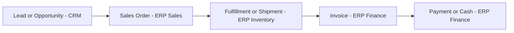
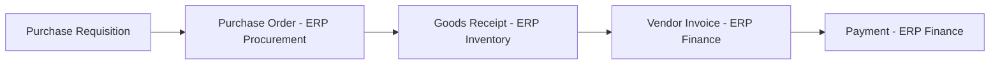

# Lecture 3 — End-to-End Enterprise Processes

Lectures 1 and 2 gave you the pieces: modules, master data, single source of truth. This lecture puts them in motion. Real enterprise value doesn't come from any one table or module — it comes from a **process**, a chain of steps that crosses module (and often system) boundaries, each step depending on data the previous step created. The two canonical processes every ERP course and every ERP vendor demo centers on are **order-to-cash** (the sales side) and **procure-to-pay** (the purchasing side). Learn to trace these and you can trace almost any other enterprise process by the same method.

## 1. Order-to-cash (O2C): the sales side

**Order-to-cash** is the full journey of a sale, from the moment a customer wants something to the moment the company actually has the money in hand. Written as a chain of steps:

```
Lead/Opportunity → Sales Order → Fulfillment/Shipment → Invoice → Payment/Cash
   (CRM)              (ERP-Sales)    (ERP-Inventory)      (ERP-Finance)  (ERP-Finance)
```


*Order-to-cash crosses CRM and three ERP modules before a sale becomes cash in hand.*

Each arrow is a place where data has to move correctly from one part of the system to the next, and where a lot of real-world failure happens:

1. **Lead/Opportunity (CRM).** A sales rep is pursuing a deal. It has a `stage`, an estimated value, an owning rep. Nothing has shipped, nothing is owed. This is the `crm_opportunities` table you loaded this week.
2. **Sales Order (ERP-Sales).** The deal is won. Someone (a rep, or an integration job) creates a real order: specific products, specific quantities, a specific customer, a specific date. This is `orders` + `order_items`.
3. **Fulfillment/Shipment (ERP-Inventory).** The warehouse picks, packs, and ships the order. Inventory decreases. In Crunch Cycles' simplified schema this is represented by `orders.ship_date` — the moment it stops being `NULL`.
4. **Invoice (ERP-Finance).** The company bills the customer for what shipped. A real ERP has a dedicated `invoices` table (Crunch Cycles doesn't, to keep this week's schema manageable — you'll design one in the mini-project if you choose the stretch goal).
5. **Payment/Cash (ERP-Finance).** The customer pays. The invoice is marked paid; cash moves. This is where "order-to-cash" gets its name — the process isn't done when the product ships, it's done when the company is actually paid.

Trace steps 1 → 2 with the data you already have:

```sql
SELECT
    co.opportunity_id,
    co.stage,
    co.est_value        AS forecast_value,
    o.order_id,
    o.order_date,
    o.ship_date,
    o.status,
    SUM(oi.quantity * oi.unit_price) AS actual_order_value
FROM crm_opportunities co
JOIN orders o       ON o.order_id = co.won_order_id
JOIN order_items oi ON oi.order_id = o.order_id
WHERE co.won_order_id IS NOT NULL
GROUP BY co.opportunity_id, co.stage, co.est_value, o.order_id, o.order_date, o.ship_date, o.status
ORDER BY co.opportunity_id;
```

Look at the output: `forecast_value` (what the rep guessed while the deal was still open) and `actual_order_value` (what was actually ordered) rarely match exactly. That gap is the entire reason sales forecasting is a discipline of its own — CRM data is a prediction, ERP data is a fact, and a mature company tracks the difference to get better at predicting.

Now trace the parts of O2C that *haven't* finished — this is where a real business finds risk:

```sql
-- Orders that shipped but check their status for cancellation-after-fulfillment risk
SELECT order_id, customer_id, order_date, ship_date, status
FROM orders
WHERE status = 'Pending' AND ship_date IS NULL;

-- Won opportunities that somehow have no matching order — a process break worth investigating
SELECT opportunity_id, customer_id, employee_id, stage, won_order_id
FROM crm_opportunities
WHERE stage = 'Won' AND won_order_id IS NULL;
```

The second query returns zero rows in this week's clean seed data — but in a real production system, it wouldn't. A rep marks a deal "Won" in the CRM the moment the customer verbally agrees, days or weeks before an actual sales order gets typed into the ERP (or before an integration job syncs it over). That gap — "Won" in CRM with nothing yet in ERP — is a live, everyday inconsistency at real companies, and it's exactly the kind of thing Week 7's integration work exists to close.

## 2. Procure-to-pay (P2P): the purchasing side

**Procure-to-pay** is order-to-cash's mirror image: instead of the company selling something and getting paid, the company is *buying* something and *paying*.

```
Purchase Requisition → Purchase Order → Goods Receipt → Vendor Invoice → Payment
     (internal need)      (ERP-Procurement)  (ERP-Inventory)  (ERP-Finance)   (ERP-Finance)
```


*Procure-to-pay mirrors order-to-cash from the buying side, ending in a three-way match before payment.*

1. **Purchase requisition.** Someone internally (a buyer, an automated reorder-point trigger) decides more stock is needed. Crunch Cycles' schema skips this step for simplicity — in a mature ERP it's its own approval-workflow table.
2. **Purchase order (ERP-Procurement).** A formal commitment to a specific supplier: what, how much, at what cost, by when. This is `purchase_orders` + `purchase_order_items`.
3. **Goods receipt (ERP-Inventory).** The shipment physically arrives and is checked in. `purchase_orders.received_date` going from `NULL` to a real date is this event.
4. **Vendor invoice (ERP-Finance).** The supplier bills the company. In a real system this gets **three-way matched** against the PO and the goods receipt before payment is approved (see below).
5. **Payment (ERP-Finance).** The company pays the supplier, on the agreed terms.

Trace this week's data end to end:

```sql
SELECT
    po.po_id,
    s.supplier_name,
    po.po_date,
    po.expected_date,
    po.received_date,
    po.status,
    (po.received_date - po.po_date) AS actual_lead_time_days,
    s.lead_time_days                AS quoted_lead_time_days,
    SUM(poi.quantity * poi.unit_cost) AS po_total_cost
FROM purchase_orders po
JOIN suppliers s ON s.supplier_id = po.supplier_id
JOIN purchase_order_items poi ON poi.po_id = po.po_id
GROUP BY po.po_id, s.supplier_name, po.po_date, po.expected_date, po.received_date, po.status, s.lead_time_days
ORDER BY po.po_id;
```

PO 2 is the interesting row: it arrived on `2024-02-05`, five days *after* its `expected_date` of `2024-01-31`. That's a **supplier performance signal** — the kind of thing a procurement team tracks over time to decide whether to keep buying from a supplier, negotiate better terms, or move volume to a backup (recall product 1 and product 8 each have a non-preferred backup supplier in `product_suppliers` for exactly this reason).

## 3. The "three-way match" — where P2P earns its reputation for rigor

The single most important control in procure-to-pay, and one every accounting and audit course covers, is the **three-way match**: before a supplier gets paid, three independent records have to agree —

1. **The purchase order** — what we said we'd buy, and at what price.
2. **The goods receipt** — what we actually received.
3. **The vendor's invoice** — what they're billing us for.

If a supplier invoices for 60 units but the goods receipt only confirms 50 arrived, the invoice gets held, not paid, until the discrepancy is resolved. This single check is one of the biggest reasons ERP systems exist at all — it's very hard to enforce with spreadsheets and email, because it requires three different people/teams' records to be compared automatically, every time, without anyone forgetting.

You can approximate a version of it with what you have:

```sql
-- POs where the ordered quantity and the (simplified) received status disagree
-- In this schema "received" is PO-level, not line-level — a real system tracks receipts per line
SELECT po.po_id, po.status, po.received_date,
       SUM(poi.quantity) AS total_units_ordered
FROM purchase_orders po
JOIN purchase_order_items poi ON poi.po_id = po.po_id
GROUP BY po.po_id, po.status, po.received_date
ORDER BY po.po_id;
```

This week's schema simplifies receiving to a single date on the PO header, which is a deliberate simplification — a production ERP tracks receipts **per line item**, because partial shipments (40 of 60 units arrive now, 20 later) are the norm, not the exception. That's a good design question to sit with: what would you add to this schema to support partial receipts? (You'll get a chance to extend it in the mini-project's stretch goals.)

## 4. Why "tracing a process" is the actual enterprise-systems skill

Notice what every query in this lecture has in common: it **joins across tables that were, in Week 4's schema, unrelated** — `crm_opportunities` didn't exist until this week; connecting it to `orders` is new. This is the whole game of enterprise systems work. Nobody hands you a single table and asks a single-table question. They hand you a business process — "why did this order take so long to ship," "which supplier is costing us the most in late deliveries," "which deals never converted" — and your job is to know which tables the process touches, in which order, and how they connect.

That skill transfers directly. Whether the "system" is a $2M SAP deployment or the seven tables you built this week, tracing order-to-cash or procure-to-pay is the same discipline: find the master data (who, what), find the transactional chain (in what order did events happen), and join them in the order the business process actually flows.

## 5. Check yourself

- List the five steps of order-to-cash in order, and name which module (CRM or which ERP module) owns each one.
- List the five steps of procure-to-pay in order.
- What is a three-way match, and why does it require automation to enforce reliably at scale?
- In this week's schema, what event turns a `purchase_orders` row from "Open" to effectively "Received"? What real-world limitation does tracking receipt at the PO level (not the line level) create?
- Why would a "Won" CRM opportunity with no matching ERP sales order be a red flag worth investigating, rather than something to ignore?

## Further reading

Head to the [exercises](../exercises/README.md) to practice mapping modules, classifying master vs. transactional data, and tracing order-to-cash yourself with real queries.
