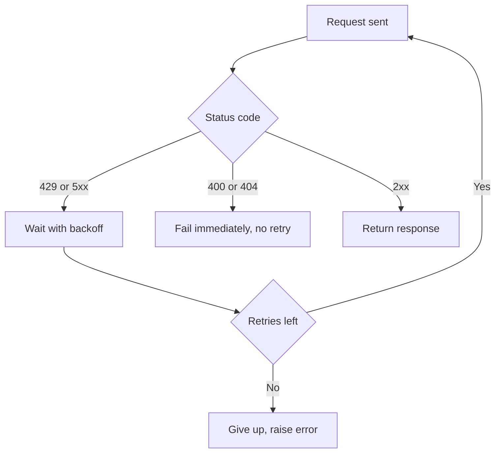
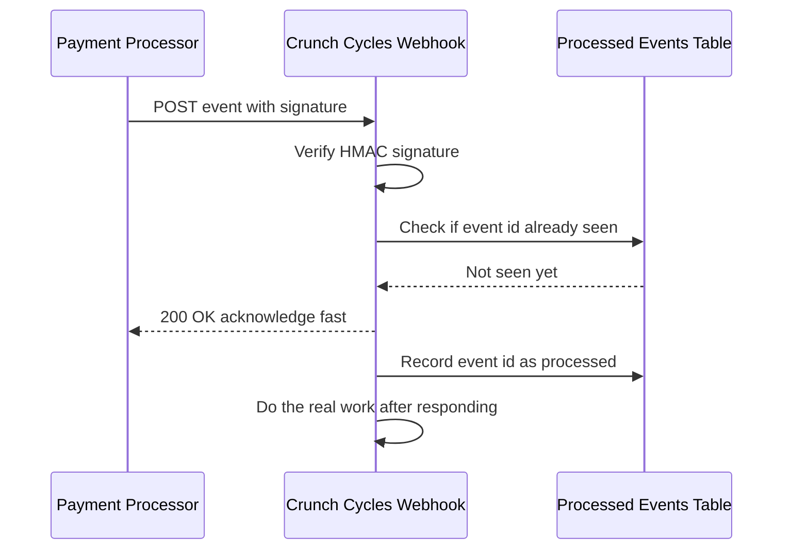

# Consuming APIs & Webhooks — Calling Third-Party Services and Reacting to Events

Lecture 1 built the side of the contract Crunch Cycles controls. Most of your integration work in the real world is the opposite: you're the *consumer*, calling an API someone else built, that you cannot change and whose failures you cannot fix — only handle gracefully. This lecture covers calling APIs defensively, and its mirror image: **webhooks**, where instead of you asking "did anything happen?" over and over, the other system tells you the moment it does.

## Crunch Cycles needs a real exchange rate

Crunch Cycles sells in four regions and reports revenue in USD. Every `orders`/`order_items` row is priced in the currency of whoever sold it, effectively — for this course, assume all prices in the seed data are USD list prices, but Crunch Cycles' finance team wants a `fx_rates` table so European and APAC revenue can be re-expressed in EUR or JPY for regional reporting. That means pulling real daily exchange rates from somewhere. We'll use the **Frankfurter API** — a free, no-signup-required, public API published by the European Central Bank's reference data:

```bash
curl "https://api.frankfurter.dev/v1/latest?base=USD&symbols=EUR,JPY,GBP,BRL"
```

```json
{
  "amount": 1.0,
  "base": "USD",
  "date": "2024-11-08",
  "rates": {
    "EUR": 0.9231,
    "JPY": 152.87,
    "GBP": 0.7714,
    "BRL": 5.7501
  }
}
```

No API key needed for Frankfurter, which makes it a clean first example — the auth and rate-limiting concepts below still apply, you just won't hit them practicing against this particular API. You'll hit them for real in the exercises against a stricter public API.

## Calling an API with `requests`

```python
import requests

response = requests.get(
    "https://api.frankfurter.dev/v1/latest",
    params={"base": "USD", "symbols": "EUR,JPY,GBP,BRL"},
    timeout=10,   # NEVER omit this — a hung request without a timeout can block forever
)
response.raise_for_status()   # throws if status is 4xx/5xx, instead of silently continuing
data = response.json()
print(data["rates"]["EUR"])
```

Three habits that separate a script that works on your laptop from one that survives in production:

1. **Always set a `timeout`.** Without one, a `requests.get()` call can hang indefinitely if the server never responds — your whole pipeline stalls waiting on one bad connection.
2. **Always call `raise_for_status()` (or check `response.status_code` yourself).** `requests` does **not** raise an exception automatically on a 404 or 500 — it happily hands you an error page as if it were data, and code that assumes `response.json()` worked will fail confusingly two lines later.
3. **Never assume the response is JSON just because you asked for it.** A 500 from a misconfigured proxy is often HTML. Catch the parse error and log the raw body.

## Authenticated calls

Most real APIs require credentials. The two shapes you'll meet constantly:

```python
# API key in a header (most common for server-to-server APIs)
headers = {"Authorization": f"Bearer {API_KEY}"}
response = requests.get("https://api.example.com/v1/resource", headers=headers, timeout=10)

# API key as a query parameter (older-style APIs)
response = requests.get(
    "https://api.example.com/v1/resource",
    params={"api_key": API_KEY},
    timeout=10,
)
```

**Never hard-code a credential in a script you might commit.** Load it from an environment variable via `python-dotenv`:

```python
from dotenv import load_dotenv
import os

load_dotenv()  # reads a local .env file, which is in .gitignore
API_KEY = os.environ["THIRD_PARTY_API_KEY"]
```

If a key ever does end up in a commit, treat it as compromised — rotate it, don't just remove it from a later commit (it's still in the Git history).

## Pagination: getting everything, not just the first page

An API rarely hands you an entire dataset in one response — that would let one careless request bring down the server. Instead it **paginates**, and you're expected to loop. Two common styles:

**Offset/limit pagination** (mirrors the SQL you already know):

```python
import requests

def fetch_all_offset(url, page_size=100):
    results, offset = [], 0
    while True:
        resp = requests.get(url, params={"limit": page_size, "offset": offset}, timeout=10)
        resp.raise_for_status()
        page = resp.json()
        results.extend(page["items"])
        if len(page["items"]) < page_size:      # short page = last page
            break
        offset += page_size
    return results
```

**Cursor-based pagination** (common on high-volume APIs, because offset pagination gets slow *and* unstable — a row inserted mid-page-through shifts every subsequent offset by one):

```python
def fetch_all_cursor(url):
    results, cursor = [], None
    while True:
        params = {"cursor": cursor} if cursor else {}
        resp = requests.get(url, params=params, timeout=10)
        resp.raise_for_status()
        page = resp.json()
        results.extend(page["items"])
        cursor = page.get("next_cursor")
        if not cursor:
            break
    return results
```

The tell for which style an API uses is in its docs and its response shape: if the response includes a `next_cursor` or a `Link: <...>; rel="next"` header, follow the cursor. If it just gives you a `total_count`, do offset math yourself.

## Rate limits: you will get a 429 eventually

Every public API limits how often you can call it — Frankfurter is generous, most commercial APIs are not. When you exceed the limit, you get **`429 Too Many Requests`**, often with a `Retry-After` header telling you how many seconds to wait.

```python
import time
import requests

def get_with_backoff(url, params=None, max_retries=5):
    for attempt in range(max_retries):
        resp = requests.get(url, params=params, timeout=10)
        if resp.status_code == 429:
            wait = int(resp.headers.get("Retry-After", 2 ** attempt))
            print(f"Rate limited. Waiting {wait}s (attempt {attempt + 1}/{max_retries})")
            time.sleep(wait)
            continue
        resp.raise_for_status()
        return resp
    raise RuntimeError(f"Gave up after {max_retries} retries on {url}")
```

This is **exponential backoff**: 1s, 2s, 4s, 8s, 16s between attempts, so a temporary spike in load doesn't turn into you hammering the API every 100ms and making the problem worse. Production systems often add **jitter** (a small random offset) so that if a thousand clients all got rate-limited at once, they don't all retry in perfect unison and re-trigger the same wall.

The same backoff pattern applies to `500`/`502`/`503`/`504` responses and connection errors — those are usually *transient*, worth retrying. A `400` or `404`, by contrast, will **never** succeed on retry — the request itself is wrong, and retrying just wastes calls. **Only retry the errors that retrying can fix.**


*Only the transient failures loop back through backoff — a client error never gets retried.*

```python
def get_resilient(url, params=None, max_retries=5):
    for attempt in range(max_retries):
        try:
            resp = requests.get(url, params=params, timeout=10)
        except requests.exceptions.ConnectionError:
            time.sleep(2 ** attempt)
            continue
        if resp.status_code == 429 or resp.status_code >= 500:
            wait = int(resp.headers.get("Retry-After", 2 ** attempt))
            time.sleep(wait)
            continue
        resp.raise_for_status()   # 4xx other than 429 raises immediately — no point retrying
        return resp
    raise RuntimeError(f"Gave up after {max_retries} retries on {url}")
```

## Webhooks: the API calling *you*

Polling — repeatedly asking "did the payment go through yet?" — wastes calls and is always at least a little bit late. A **webhook** flips the direction: you register a URL with the third-party service, and *they* send you an HTTP `POST` the instant something happens. A payment processor sends `order.paid`; a shipping carrier sends `package.delivered`; GitHub sends `pull_request.opened`. Your job is to build a small server that receives, verifies, and reacts to these.

### A webhook receiver in Flask

```python
from flask import Flask, request, jsonify, abort
import hmac
import hashlib

app = Flask(__name__)
WEBHOOK_SECRET = "whsec_shared_with_the_payment_processor"

@app.post("/webhooks/payments")
def handle_payment_webhook():
    raw_body = request.get_data()            # verify against the RAW bytes, not parsed JSON
    signature = request.headers.get("X-Signature", "")

    expected = hmac.new(WEBHOOK_SECRET.encode(), raw_body, hashlib.sha256).hexdigest()
    if not hmac.compare_digest(expected, signature):
        abort(401, description="signature mismatch")

    event = request.get_json()
    event_id = event["id"]
    event_type = event["type"]

    if already_processed(event_id):           # idempotency — see below
        return jsonify({"status": "duplicate, ignored"}), 200

    if event_type == "order.paid":
        mark_order_paid(event["data"]["order_id"])
    record_processed(event_id)

    return jsonify({"status": "ok"}), 200      # respond fast — see below
```

Three non-negotiable rules for a production webhook receiver:

1. **Verify the signature.** Anyone on the internet can `POST` to a public URL and claim to be your payment processor. A webhook payload is almost always accompanied by a signature — an HMAC computed from a shared secret and the raw request body. Compute it yourself and compare with `hmac.compare_digest` (a timing-safe comparison — a plain `==` on secrets can leak information through response-time differences). **Never trust an unverified webhook body.**
2. **Respond fast, then do the work.** The sender is often waiting on your response and will consider the delivery *failed* — and retry — if you take too long (many services time out around 10–30 seconds). If "mark the order paid" also needs to email a receipt and update three other tables, acknowledge the webhook first (`200` as soon as you've durably recorded the event), then process it — in a background job, a queue, or at minimum, after the fact. Don't make the sender wait on your slowest downstream step.
3. **Expect duplicates and design for them.** Because the sender treats "no response" or a slow response as failure, it will **retry** — meaning you may receive the exact same event twice, or three times. This is not a bug in their system; it's a deliberate design choice (at-least-once delivery), and it is *your* job to be idempotent on receipt.


*Verify first, acknowledge fast, then do the slow work — duplicates are handled by checking the processed-events table before acting.*

### Idempotent webhook handling

The fix is the same shape every time: give every event a unique ID (the sender provides one), and check whether you've already handled it before doing anything with side effects.

```sql
CREATE TABLE processed_webhook_events (
    event_id    TEXT PRIMARY KEY,
    event_type  TEXT NOT NULL,
    received_at TIMESTAMP NOT NULL DEFAULT now()
);
```

```python
def already_processed(event_id: str) -> bool:
    with engine.connect() as conn:
        row = conn.execute(
            text("SELECT 1 FROM processed_webhook_events WHERE event_id = :id"),
            {"id": event_id},
        ).first()
    return row is not None

def record_processed(event_id: str, event_type: str):
    with engine.begin() as conn:   # begin() commits automatically, or rolls back on exception
        conn.execute(
            text("""INSERT INTO processed_webhook_events (event_id, event_type)
                     VALUES (:id, :type)
                     ON CONFLICT (event_id) DO NOTHING"""),
            {"id": event_id, "type": event_type},
        )
```

The `PRIMARY KEY` on `event_id` plus `ON CONFLICT DO NOTHING` gives you a **race-safe** dedup check even if two webhook deliveries arrive at nearly the same instant and both requests reach the "not yet processed" check before either has recorded itself — the database, not your Python code, is the final arbiter of "have I seen this before."

### Testing webhooks locally

A third-party service can't `POST` to `localhost` — it needs a public URL. For local development, a tunneling tool exposes your local Flask server at a temporary public address:

```bash
ngrok http 5000
# forwards https://a1b2c3.ngrok.io  →  http://localhost:5000
```

Register `https://a1b2c3.ngrok.io/webhooks/payments` with the sandbox/test mode of whatever service you're integrating, and its real webhook deliveries land straight on your machine — the exact setup you'll use, minus the third-party account, in Exercise 3.

## What's next

You can now call other systems and receive their events. Lecture 3 puts both directions together into a repeatable job — extracting data on a schedule, transforming it, and loading it into Postgres in a way that's safe to run again after a failure.
