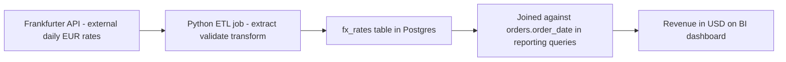

# Data Governance — Ownership, Retention, Quality, and Lineage

Access control (Lecture 1) says who can touch data. Privacy (Lecture 2) says what you owe the people the data describes. **Governance** is the layer underneath both: the standing policies that keep data trustworthy, accountable, and cleaned up *over time* — after the exercise is graded, after the person who built the table has moved to another project, three years from now when someone new joins and has to figure out whether `orders.status = 'Pending'` still means what it meant when the column was added. Governance is unglamorous in exactly the way Week 7's integration lecture said integration is unglamorous: invisible when done well, expensive when skipped.

This lecture covers four questions every table in a production system should be able to answer, using Crunch Cycles as the worked example: **who owns it, how long do we keep it, how do we know it's trustworthy, and where did it come from.**

## 1. Ownership — who is accountable when something's wrong

Every table needs a named **data owner**: a specific role (not "the team," not "whoever's around") accountable for its accuracy, its access policy, and its lifecycle decisions. Ownership doesn't mean that person writes every query against the table — it means when a customer reports a wrong email on their account, or an auditor asks "why do we retain this column," there is exactly one person who is supposed to know the answer or find it fast.

A **data catalog** is the artifact that records this — a table describing your tables:

```sql
CREATE TABLE data_catalog (
    table_name      TEXT PRIMARY KEY,
    description      TEXT NOT NULL,
    owner_role        TEXT NOT NULL,           -- 'sales_manager' | 'finance' | 'admin' | ...
    contains_pii      BOOLEAN NOT NULL,
    classification    TEXT NOT NULL,           -- 'public' | 'internal' | 'confidential' | 'restricted'
    retention_period   TEXT NOT NULL,           -- human-readable; e.g. '7 years post-fiscal-year'
    last_reviewed_at   DATE NOT NULL
);

INSERT INTO data_catalog VALUES
('customers',   'Business customer accounts and contacts',      'sales_manager', TRUE,  'confidential', '3 years after last order, then pseudonymize', '2026-01-15'),
('employees',   'Crunch Cycles staff records',                  'admin',         TRUE,  'restricted',   'Per employment law in country of hire',        '2026-01-15'),
('orders',      'Order headers: who, when, status',              'finance',       FALSE, 'internal',     '7 years (tax/financial record)',                 '2026-01-15'),
('order_items', 'Order line items: products, quantity, price',   'finance',       FALSE, 'internal',     '7 years (tax/financial record)',                 '2026-01-15'),
('products',    'Product catalog: bikes and accessories',        'sales_manager', FALSE, 'public',       'Retained indefinitely (no personal data)',       '2026-01-15'),
('app_users',   'Login accounts for internal staff',             'admin',         TRUE,  'restricted',   'Deactivated accounts purged after 1 year',       '2026-01-15');
```

Even this small table answers, in one query, questions that otherwise turn into a scramble: *"Which tables hold personal data?"* → `WHERE contains_pii = TRUE`. *"Who do I ask about the orders table?"* → `finance`. *"When did anyone last actually check this policy was still accurate?"* → `last_reviewed_at`, which itself needs governance — a catalog nobody updates for three years is worse than no catalog, because it's actively misleading.

**Classification levels**, used consistently across the catalog and Lecture 1's access grants:

- **Public** — no harm if exposed (the product catalog).
- **Internal** — not meant for outsiders, but low individual risk if leaked (aggregate order counts).
- **Confidential** — real harm to a person or the business if exposed (customer contact details, contract terms).
- **Restricted** — the highest bar — legal, financial, or safety consequences (employee compensation, authentication credentials, health data if any existed here).

Classification is the bridge between this lecture and Lecture 1: `restricted` data should map directly to the tightest RBAC/RLS grants, and `public` data needs none at all. If your access grants and your classification disagree — a `confidential` column any authenticated user can read — that mismatch is itself a governance defect worth its own line in a threat model.

## 2. Retention — how long, and what happens at the end

A **retention policy** states, per table (or per column, when a table mixes fast-expiring and long-lived data), exactly how long data is kept and what happens when that period ends: hard delete, archive to cold storage, or pseudonymize. "Keep everything forever" is not a policy — it's the absence of one, and it directly conflicts with Lecture 2's storage-limitation principle and inflates the blast radius of every future breach.

Three real retention rules for Crunch Cycles, each with a different justification and mechanism:

| Table / column | Retention | Why | Mechanism |
|---|---|---|---|
| `orders`, `order_items` | 7 years after order date | Tax and financial audit requirements in most jurisdictions | Archive to cold storage after 2 years (rarely queried but still required); never deleted before year 7 |
| `customers` (contact fields) | 3 years after last order, then pseudonymize | No ongoing business need to keep an inactive contact's personal details; financial rows underneath are preserved | Scheduled job (Exercise 3) runs the pseudonymization `UPDATE` from Lecture 2 |
| `app_users` (deactivated accounts) | 1 year after deactivation, then hard delete | An ex-employee's login should not linger indefinitely as an unused attack surface | Scheduled job deletes rows where `is_active = FALSE AND updated_at < now() - interval '1 year'` |

```sql
-- The scheduled job for customer pseudonymization — run monthly
UPDATE customers
SET contact_name = 'ERASED-' || customer_id,
    email = 'erased-' || customer_id || '@deleted.invalid',
    city = NULL
WHERE customer_id NOT IN (
    SELECT DISTINCT customer_id FROM orders
    WHERE order_date > now() - interval '3 years'
)
AND contact_name NOT LIKE 'ERASED-%';   -- don't re-process already-pseudonymized rows
```

Notice the mechanism differs by table: some data is archived (still exists, just moved somewhere cheaper and slower), some is pseudonymized (the fact survives, the identity doesn't), and some is genuinely deleted. Writing "retention: 7 years" without saying *which* of those three happens at the end is an incomplete policy — Exercise 3 has you write all three explicitly.

## 3. Data quality — can you actually trust what's in the table

A schema with perfect constraints (Week 3) still degrades over time: a source system changes its format, an ETL job (Week 7) silently drops a field, a manual data-entry process introduces typos. **Data quality** is usually measured across five dimensions, each with a concrete SQL check:

| Dimension | Question | Crunch Cycles check |
|---|---|---|
| **Completeness** | Are required fields actually filled in? | `SELECT COUNT(*) FROM customers WHERE email IS NULL;` — should be 0 if `email` is meant to be required in practice, even if the column allows `NULL` for legacy rows |
| **Accuracy** | Does the data reflect reality? | Spot-check: does `orders.ship_date` ever precede `orders.order_date`? `SELECT * FROM orders WHERE ship_date < order_date;` should return nothing |
| **Consistency** | Does the same fact agree across tables? | Does `SUM(order_items.quantity * order_items.unit_price)` for an order match any cached total stored elsewhere? |
| **Timeliness** | Is the data current enough to be useful? | `SELECT MAX(order_date) FROM orders;` — if this lags today by weeks, the ETL job feeding it from Week 7 has likely failed silently |
| **Uniqueness** | Are there duplicate records that should be one? | `SELECT email, COUNT(*) FROM customers GROUP BY email HAVING COUNT(*) > 1;` — the same company entered twice under slightly different names |

None of these are one-time checks — they're queries worth running on a schedule (a nightly job, or a dashboard) so quality problems surface in days, not when a customer complains their order total is wrong. A governance policy that names quality dimensions but never runs a query to measure them is, again, a policy in name only.

```sql
-- A minimal data-quality report, runnable on demand
SELECT
    'orders_missing_customer' AS check_name,
    COUNT(*) AS violation_count
FROM orders o LEFT JOIN customers c ON o.customer_id = c.customer_id
WHERE c.customer_id IS NULL
UNION ALL
SELECT 'ship_before_order', COUNT(*)
FROM orders WHERE ship_date < order_date
UNION ALL
SELECT 'customers_missing_email', COUNT(*)
FROM customers WHERE email IS NULL
UNION ALL
SELECT 'duplicate_customer_email', COUNT(*)
FROM (SELECT email FROM customers GROUP BY email HAVING COUNT(*) > 1) dupes;
```

A report like this returning all zeros is the actual evidence a governance policy is being honored — not the policy document itself, which only states intent.

## 4. Lineage — where did this number actually come from

**Data lineage** traces a piece of data from its origin, through every transformation, to where it's finally used — the answer to "why does this dashboard say $482,000 and where would I go to check that." Week 7 already built a real lineage chain without naming it: the `fx_rates` table is populated by an ETL job pulling from the Frankfurter public API, transformed (currency codes normalized, a rate date attached), and loaded into Postgres, where Week 10's dashboards will read it.

```
Frankfurter API (external, daily EUR base rates)
      │  Python ETL job (Week 7, Lecture 3) — extract, validate, transform
      ▼
fx_rates table (crunchcycles Postgres)
      │  joined against orders.order_date in reporting queries
      ▼
Revenue-in-USD figures on Week 10's BI dashboard
```

Documenting lineage doesn't require special tooling for a system this size — a short Markdown diagram like the one above, kept next to the ETL job's code and updated when the pipeline changes, answers the two questions that matter most in practice: **when this number looks wrong, which upstream system do I check first**, and **if the source API changes its format, which downstream reports break**. At larger scale, dedicated lineage tools (e.g., OpenLineage, dbt's built-in lineage graph) automate this tracing across dozens of pipelines — worth knowing the term for, not required to build here.


*The same lineage chain as above, redrawn as a traceable pipeline from source to dashboard.*

## Putting it together — a governance policy is short

A real governance policy for a system this size fits on one page, because its job is to be *read*, not to be exhaustive. It should state, for the tables that matter most:

1. **Ownership** — who to ask.
2. **Retention** — how long, and what happens at the end (delete, archive, or pseudonymize).
3. **Quality** — what "trustworthy" means for this table and how it's checked.
4. **Lineage** — where the data comes from and where it flows to, for the pipelines that matter.

The mini-project this week has you write exactly that page for Crunch Cycles — and the discipline of keeping it to one page is itself the point: a policy nobody reads because it's forty pages long protects nothing.

## What's next

You now have all three layers this week set out to build: who can access what (Lecture 1), what you owe the people the data describes (Lecture 2), and the standing policy that keeps the data trustworthy over time (this lecture). The exercises turn each into working code and a real document; the mini-project assembles all three into one hardened system with its governance policy attached.
