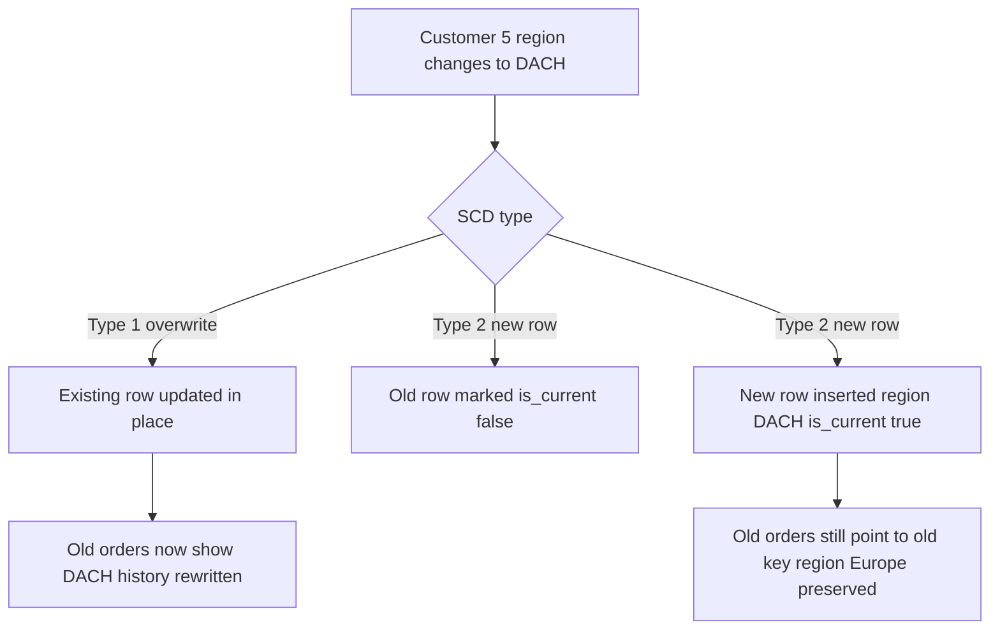
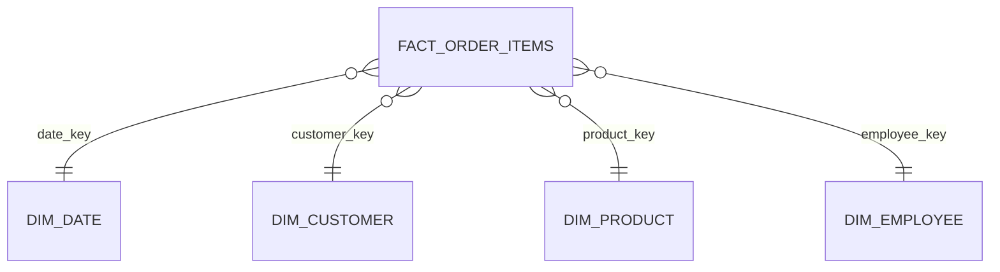

# Dimensional Modeling — Facts, Dimensions & Star Schemas

Lecture 1 established *why* Crunch Cycles needs a warehouse. This lecture builds its actual shape: **dimensional modeling**, the design technique nearly every analytical database in the world uses, invented by Ralph Kimball specifically to make a warehouse fast to query and easy for a human to reason about. By the end, you'll have real `CREATE TABLE` statements for `crunchcycles_dw.warehouse` — a fact table and four dimension tables — and you'll know exactly why each design decision was made, not just how to copy it.

## 1. Facts and dimensions

Every dimensional model splits the world into two kinds of table:

- **Facts** — the numbers business questions are actually about: a quantity, a price, a revenue amount. A fact table's rows are **events** or **measurements** — "this line item, on this order, sold this many units at this price."
- **Dimensions** — the context that gives a fact meaning: *who* (customer, employee), *what* (product), *when* (date), *where* (region). Dimension tables answer "by what do you want to slice this number?"

Take the business question from Lecture 1: "revenue by region by quarter." Revenue is the **fact** (a measurement). Region and quarter are **dimensions** (ways of slicing that measurement). Every BI question decomposes this way: a measure, sliced by one or more dimensions. Once you can see a question that shape, the schema nearly designs itself.

## 2. Grain: the single most important decision

A fact table's **grain** is the precise statement of what one row represents. Get the grain wrong and every query built on top of the table is wrong in some subtle way that doesn't show up until someone double-counts revenue in a board meeting.

For Crunch Cycles' sales fact table, three candidate grains, in increasing detail:

| Candidate grain | One row = | Problem |
|---|---|---|
| One row per **order** | An entire order, aggregated | Can't answer "revenue by product" — a multi-item order has one row but many products |
| One row per **order line item** | One product, one quantity, on one order | ✅ Chosen — this is the finest grain the source data actually has |
| One row per **unit sold** | One physical bicycle/accessory | Over-granular for this data — `order_items.quantity` is already a count, not individual serialized units; going finer invents detail the source doesn't have |

**Chosen grain: one row per order line item.** This matches exactly one row of the OLTP `order_items` table — the finest-grained fact the source data supports, which is the right default rule: *build the fact table at the grain of the source data unless you have a specific, stated reason to aggregate coarser.* You can always aggregate a fine-grained fact table up to "revenue by order" or "revenue by month" with `GROUP BY` at query time; you can never *disaggregate* a fact table that was built too coarse. When in doubt, grain fine.

State a fact table's grain in one sentence, in a comment above its `CREATE TABLE`, every time. It is the single fact (no pun intended) every future person querying this table needs to know first.

## 3. Star schema vs. snowflake schema

A **star schema** puts one fact table at the center, directly joined to a small number of **denormalized** dimension tables — each dimension flattens what would be several normalized OLTP tables into one wide table. A **snowflake schema** normalizes the dimensions further, splitting them into sub-tables (e.g., `dim_customer` → `dim_customer` + `dim_region` as two joined tables, mirroring the OLTP structure more closely).

```
        STAR                              SNOWFLAKE
                                          
   dim_customer                      dim_customer ─── dim_region
        │                                  │
        │                                  │
dim_date ─ fact_order_items ─ dim_product   fact_order_items
        │                                  │
   dim_employee                       dim_employee ─── dim_region
```

This week uses a **star schema**, and denormalizes region directly into `dim_customer` and `dim_employee` (rather than a separate `dim_region` table) — deliberately. The trade-off:

| | Star (denormalized dims) | Snowflake (normalized dims) |
|---|---|---|
| Query joins | Fewer — fact joins directly to each dimension | More — some dimension queries need a second join |
| Query speed | Faster (fewer joins) | Slower (more joins) |
| Storage | More (region name repeated in every customer row) | Less (region stored once, referenced) |
| Ease of understanding | Easier — an analyst reads one wide `dim_customer` row and sees everything | Harder — the analyst has to know to also join `dim_region` |

Storage is cheap; analyst confusion and slow dashboards are not. **Star wins by default** for a warehouse meant to be queried by people who aren't full-time database engineers — which describes almost every warehouse's actual audience. Denormalizing `region_name` straight into `dim_customer` and `dim_employee` means "revenue by region" needs one join (fact → dim_customer), not two (fact → dim_customer → dim_region).

## 4. Surrogate keys, not natural keys

Every dimension table gets its own **surrogate key** — a warehouse-generated integer (`SERIAL`), meaningless outside the warehouse — instead of reusing the OLTP `customer_id`/`product_id` as the join key.

Three reasons this matters, not just convention for its own sake:

1. **Decoupling from the source's ID scheme.** If Crunch Cycles ever adds a second source system (a POS system with its own `customer_id` numbering) the warehouse needs one clean join target per dimension row, independent of which source produced it — a surrogate key gives you that; a natural key ties you permanently to one source's numbering.
2. **Slowly changing dimensions need it.** As you'll see in §5, a Type 2 SCD keeps *multiple rows* for the same real-world customer (one per historical version). Those rows can't all share the same natural `customer_id` as a primary key — but they can each get their own surrogate `customer_key`.
3. **Insulation from the source deleting or reusing IDs.** OLTP systems sometimes recycle or hard-delete rows the warehouse still needs history for. A surrogate key means the warehouse's own referential integrity never depends on the source's ID lifecycle.

The natural key (`customer_id`, `product_id`, ...) is still stored *in* the dimension table, as a plain column — you need it to join back to the source during the ELT load — but it's never the primary key or the fact table's foreign key.

## 5. Slowly changing dimensions (SCD) — concept, one worked example

Dimension attributes change over time: a customer moves cities, a product's price changes, an employee gets promoted. A **slowly changing dimension** is the pattern for deciding what the warehouse does when that happens.

- **Type 1 — overwrite.** The dimension row is updated in place; history is lost. Simple, and correct when you only ever care about the *current* value (e.g., a customer's current contact name — nobody needs to know what it used to be).
- **Type 2 — add a new row, versioned.** The old row is kept (marked no-longer-current), and a new row is inserted for the new value, so that facts joined to the *old* row still reflect the attribute as it was *at the time of that fact*. This is how a warehouse answers "what was true then," not just "what's true now."

**Worked example.** Customer 5 (Alpine Sport Supply) is based in Munich, Germany, region `Europe`. Suppose next year Crunch Cycles reclassifies them into a new `DACH` region for reporting.

- **Type 1:** `UPDATE dim_customer SET region_name = 'DACH' WHERE customer_id = 5;` — every past order, even ones from last year, now shows as `DACH` revenue. Fine if "which region owns this customer today" is the only question anyone asks.
- **Type 2:** insert a *new* `dim_customer` row for customer 5 with `region_name = 'DACH'`, a new surrogate key, and a `valid_from` date; mark the *old* row's `valid_to` and `is_current = FALSE`. Every past fact row still points at the old surrogate key (`Europe`), so last year's "revenue by region" report doesn't silently rewrite itself. New orders get loaded against the new surrogate key (`DACH`).

This week's warehouse implements **Type 1** for every dimension — the right choice for a first warehouse, where getting the star schema and the ELT job right is the priority. `dim_customer` and `dim_employee` include an `is_current` column and the DDL comments below flag exactly where Type 2 versioning would slot in, and Challenge 1 asks you to reason about when Type 1 would silently give a wrong answer.


*Type 1 rewrites history silently; Type 2 keeps the old row so past facts still tell the truth.*

## 6. Building the star schema

Everything below runs against `crunchcycles_dw` (created in this week's README setup), inside the `warehouse` schema.

**`dim_date` — the one dimension every fact table joins to, generated, not loaded from a source:**

```sql
CREATE TABLE warehouse.dim_date (
    date_key      INTEGER PRIMARY KEY,   -- YYYYMMDD, e.g. 20240115
    full_date     DATE NOT NULL UNIQUE,
    year          INTEGER NOT NULL,
    quarter       INTEGER NOT NULL,      -- 1-4
    month         INTEGER NOT NULL,      -- 1-12
    month_name    TEXT NOT NULL,
    day           INTEGER NOT NULL,
    day_of_week   INTEGER NOT NULL,      -- 1=Monday ... 7=Sunday (ISO)
    day_name      TEXT NOT NULL,
    is_weekend    BOOLEAN NOT NULL
);

INSERT INTO warehouse.dim_date
SELECT
    CAST(TO_CHAR(d, 'YYYYMMDD') AS INTEGER)          AS date_key,
    d::date                                          AS full_date,
    EXTRACT(YEAR FROM d)::INTEGER                    AS year,
    EXTRACT(QUARTER FROM d)::INTEGER                 AS quarter,
    EXTRACT(MONTH FROM d)::INTEGER                   AS month,
    TO_CHAR(d, 'Month')                              AS month_name,
    EXTRACT(DAY FROM d)::INTEGER                     AS day,
    EXTRACT(ISODOW FROM d)::INTEGER                  AS day_of_week,
    TO_CHAR(d, 'Day')                                AS day_name,
    EXTRACT(ISODOW FROM d) IN (6, 7)                 AS is_weekend
FROM GENERATE_SERIES('2023-01-01'::date, '2026-12-31'::date, INTERVAL '1 day') AS d;
```

`dim_date` is unique among dimensions: it isn't loaded from `crunchcycles` at all — it's generated once, mathematically, wide enough to cover every order date the operational system has or will have for the next couple of years. Every fact table in a real warehouse typically joins to the *same* `dim_date` — that's called a **conformed dimension**, and it's why "quarter" means exactly the same thing in every report, forever.

**`dim_customer` — denormalized: region flattened in, no separate `dim_region` table:**

```sql
CREATE TABLE warehouse.dim_customer (
    customer_key   SERIAL PRIMARY KEY,     -- surrogate key: the fact table's join target
    customer_id    INTEGER NOT NULL,       -- natural key, from crunchcycles.customers
    company_name   TEXT NOT NULL,
    contact_name   TEXT NOT NULL,
    city           TEXT NOT NULL,
    country        TEXT NOT NULL,
    region_name    TEXT NOT NULL,          -- denormalized: flattened in from regions, not a separate dim
    signup_date    DATE NOT NULL,
    is_current     BOOLEAN NOT NULL DEFAULT TRUE,  -- Type 2 slot: flips FALSE when superseded (not used this week)
    UNIQUE (customer_id)                   -- Type 1 only: one warehouse row per source customer
);
```

**`dim_product`:**

```sql
CREATE TABLE warehouse.dim_product (
    product_key    SERIAL PRIMARY KEY,
    product_id     INTEGER NOT NULL,
    product_name   TEXT NOT NULL,
    category       TEXT NOT NULL,
    current_price  NUMERIC NOT NULL,       -- today's list price — NOT what a past order charged (see note)
    unit_cost      NUMERIC NOT NULL,
    discontinued   BOOLEAN NOT NULL,
    UNIQUE (product_id)
);
```

Note the column name: `current_price`, not `unit_price`. This is intentional and directly connects to §5 — `products.unit_price` changes over time in the OLTP system, but the fact table stores the price **actually charged on each historical order** as its own measure (`unit_price` on the fact row itself). `dim_product.current_price` is only ever "what it costs to buy this today" — never join it into a historical revenue calculation, or you'll silently restate last year's revenue at today's prices. This is exactly the trap Type 2 SCDs exist to prevent for attributes you *do* need historically; here, storing the transactional price on the fact table sidesteps the need for a Type 2 `dim_product` entirely.

**`dim_employee`:**

```sql
CREATE TABLE warehouse.dim_employee (
    employee_key   SERIAL PRIMARY KEY,
    employee_id    INTEGER NOT NULL,
    full_name      TEXT NOT NULL,
    title          TEXT NOT NULL,
    region_name    TEXT,                   -- denormalized; NULL for HQ roles with no single region
    hire_date      DATE NOT NULL,
    is_current     BOOLEAN NOT NULL DEFAULT TRUE,
    UNIQUE (employee_id)
);
```

**`fact_order_items` — grain: one row per order line item:**

```sql
-- GRAIN: one row = one product line on one order (matches crunchcycles.order_items exactly)
CREATE TABLE warehouse.fact_order_items (
    order_item_key  SERIAL PRIMARY KEY,          -- surrogate key for the fact row itself
    order_id        INTEGER NOT NULL,            -- degenerate dimension: no dim_order table needed
    order_status    TEXT NOT NULL,               -- degenerate dimension: 'Completed'|'Pending'|'Cancelled'
    date_key        INTEGER NOT NULL REFERENCES warehouse.dim_date(date_key),
    customer_key    INTEGER NOT NULL REFERENCES warehouse.dim_customer(customer_key),
    employee_key    INTEGER NOT NULL REFERENCES warehouse.dim_employee(employee_key),
    product_key     INTEGER NOT NULL REFERENCES warehouse.dim_product(product_key),
    quantity        INTEGER NOT NULL,
    unit_price      NUMERIC NOT NULL,             -- price actually charged on THIS order (not dim_product's)
    unit_cost       NUMERIC NOT NULL,             -- cost at time of sale
    extended_price  NUMERIC NOT NULL,             -- quantity * unit_price
    extended_cost   NUMERIC NOT NULL,              -- quantity * unit_cost
    gross_profit    NUMERIC NOT NULL,              -- extended_price - extended_cost
    UNIQUE (order_id, product_id_natural)          -- see note below
);
```

Wait — `product_id_natural` isn't a defined column above. Fix it before you run this: a fact table needs a way to prevent the *same* source row from being loaded twice by an idempotent ELT job (Lecture 3 and Exercise 2's whole point), but its natural composite key is `(order_id, product_id)` from the *source*, not the warehouse's own surrogate `product_key`. Store it explicitly:

```sql
CREATE TABLE warehouse.fact_order_items (
    order_item_key  SERIAL PRIMARY KEY,
    order_id        INTEGER NOT NULL,
    product_id      INTEGER NOT NULL,             -- natural key from source, kept for idempotent upserts
    order_status    TEXT NOT NULL,
    date_key        INTEGER NOT NULL REFERENCES warehouse.dim_date(date_key),
    customer_key    INTEGER NOT NULL REFERENCES warehouse.dim_customer(customer_key),
    employee_key    INTEGER NOT NULL REFERENCES warehouse.dim_employee(employee_key),
    product_key     INTEGER NOT NULL REFERENCES warehouse.dim_product(product_key),
    quantity        INTEGER NOT NULL,
    unit_price      NUMERIC NOT NULL,
    unit_cost       NUMERIC NOT NULL,
    extended_price  NUMERIC NOT NULL,
    extended_cost   NUMERIC NOT NULL,
    gross_profit    NUMERIC NOT NULL,
    UNIQUE (order_id, product_id)                  -- the load's idempotency key — see Lecture 3/Exercise 2
);
```

`order_id` and `order_status` sit directly on the fact row as plain values instead of pointing at a `dim_order` table — that's called a **degenerate dimension**: an identifier from the source system that has business meaning (an analyst needs to see "order #482" on a report) but no attributes of its own worth a separate dimension table for. Storing it directly is simpler and exactly as correct as inventing a one-column dimension table would be.


*The finished star schema: one fact table, four dimensions, each one join away.*

## 7. Why this shape answers Lecture 1's question fast

"Revenue by region by quarter" against this star schema is one join path, not five tables of OLTP joins re-derived every time:

```sql
SELECT
    c.region_name,
    d.year,
    d.quarter,
    SUM(f.extended_price) AS revenue
FROM warehouse.fact_order_items f
JOIN warehouse.dim_customer c ON f.customer_key = c.customer_key
JOIN warehouse.dim_date d     ON f.date_key = d.date_key
WHERE f.order_status = 'Completed'
GROUP BY c.region_name, d.year, d.quarter
ORDER BY c.region_name, d.year, d.quarter;
```

Every dimension is one join away from the fact table — that's the "star" shape made literal: the fact table at the center, a single join to reach any dimension's attributes. No nested joins through intermediate normalized tables, and every column an analyst might want to slice by is already sitting, denormalized, in the dimension row.

## What's next

Exercise 1 asks you to design a second star schema from scratch (before looking at anyone else's), applying grain, fact/dimension split, and the surrogate-key decision yourself. Exercise 2 builds the ELT job that actually populates the tables above from `crunchcycles`. Lecture 3 turns this warehouse into KPIs and a dashboard.
