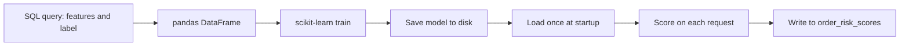
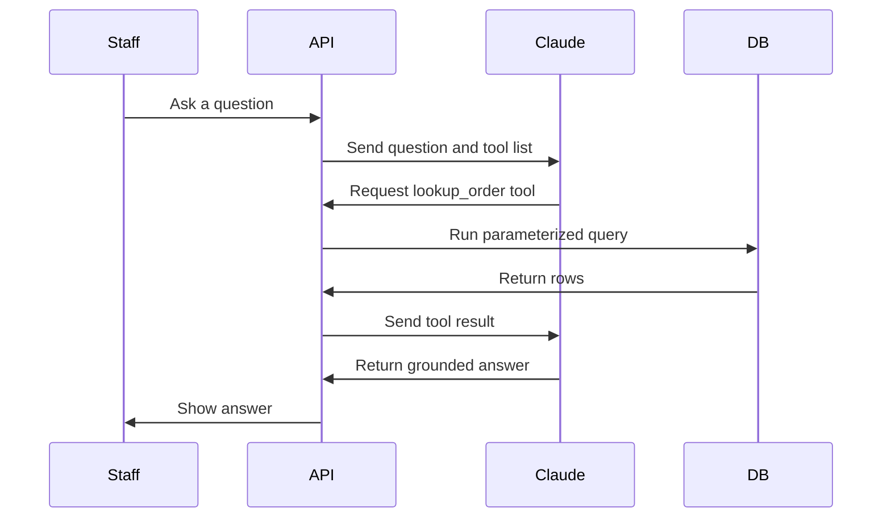

# Integrating Models & LLMs

Lecture 1 gave you the framework for deciding *whether* to build an AI feature. This lecture is about *how* — mechanically, in code — to wire two different kinds of intelligence into Crunch Cycles: a classical predictive model you train yourself on your own data, and a large language model you call over an API. They integrate differently, they fail differently, and they cost differently. Treat them as two separate patterns, not one blurry "add AI" step.

## Pattern 1: a predictive model, trained on your own SQL data

A predictive model is a program that learns a function from historical examples. For Crunch Cycles, the function is: given what we know about an order at the moment it's placed, what's the probability it ships late? You already have the historical examples — they're sitting in `orders`, `order_items`, `customers`, and `products`. Training a model is, mechanically, a SQL query, a pandas transformation, and a call to a library. No mystery.

### Step 1 — pull features and a label with SQL + pandas

"Late" needs a precise definition before anything else happens. Define it in SQL, not in your head:

```python
import pandas as pd
from sqlalchemy import create_engine

engine = create_engine("postgresql://localhost/crunchcycles")

feature_query = """
SELECT
    o.order_id,
    o.order_date,
    o.ship_date,
    -- label: TRUE if the order took more than 5 days to ship, or never shipped and is >5 days old
    CASE
        WHEN o.ship_date IS NOT NULL AND (o.ship_date - o.order_date) > 5 THEN TRUE
        WHEN o.ship_date IS NULL AND (CURRENT_DATE - o.order_date) > 5 AND o.status <> 'Cancelled' THEN TRUE
        ELSE FALSE
    END AS is_late,

    -- features: everything we know about the order AT THE MOMENT IT WAS PLACED
    r.region_name,
    c.signup_date,
    (o.order_date - c.signup_date) AS customer_tenure_days,
    COUNT(oi.product_id)            AS line_item_count,
    SUM(oi.quantity)                AS total_units,
    SUM(oi.quantity * oi.unit_price) AS order_value,
    COUNT(DISTINCT p.category)      AS distinct_categories
FROM orders o
JOIN customers c  ON c.customer_id = o.customer_id
JOIN regions r    ON r.region_id  = c.region_id
JOIN order_items oi ON oi.order_id = o.order_id
JOIN products p   ON p.product_id = oi.product_id
WHERE o.status <> 'Cancelled'
GROUP BY o.order_id, o.order_date, o.ship_date, r.region_name, c.signup_date
"""

df = pd.read_sql(feature_query, engine)
print(df.shape, df["is_late"].mean())   # sanity-check: how imbalanced is the label?
```

Two things matter here that are easy to get wrong the first time:

- **Only use information you'd actually have at prediction time.** You can't feature-engineer with `ship_date` itself (that's the outcome, not a predictor) — it's used to *compute* the label, then dropped. A model that accidentally trains on its own answer will look perfect in testing and useless in production. This mistake has a name — **label leakage** — and it's the single most common way a first ML feature quietly fails.
- **Check the label balance.** If only 4% of orders are ever late, a model that always predicts "not late" is 96% "accurate" and completely useless. You'll handle this properly in Exercise 2; for now, just print it and notice.

### Step 2 — train with scikit-learn

```python
from sklearn.model_selection import train_test_split
from sklearn.compose import ColumnTransformer
from sklearn.preprocessing import OneHotEncoder, StandardScaler
from sklearn.pipeline import Pipeline
from sklearn.linear_model import LogisticRegression
from sklearn.metrics import classification_report, roc_auc_score
import joblib

y = df["is_late"]
X = df.drop(columns=["order_id", "order_date", "ship_date", "is_late", "signup_date"])

X_train, X_test, y_train, y_test = train_test_split(
    X, y, test_size=0.25, random_state=42, stratify=y
)

categorical = ["region_name"]
numeric = ["customer_tenure_days", "line_item_count", "total_units", "order_value", "distinct_categories"]

preprocess = ColumnTransformer([
    ("cat", OneHotEncoder(handle_unknown="ignore"), categorical),
    ("num", StandardScaler(), numeric),
])

model = Pipeline([
    ("preprocess", preprocess),
    ("classify", LogisticRegression(class_weight="balanced", max_iter=1000)),
])

model.fit(X_train, y_train)

probs = model.predict_proba(X_test)[:, 1]
print(classification_report(y_test, probs > 0.5))
print("ROC-AUC:", roc_auc_score(y_test, probs))

joblib.dump({"model": model, "version": "order-risk-v1"}, "order_risk_model.joblib")
```

`class_weight="balanced"` tells scikit-learn to compensate for the label imbalance you noticed above, instead of silently learning to always predict the majority class. `roc_auc_score` gives you one number that summarizes how well the model ranks late orders above on-time ones, independent of what probability threshold you eventually pick — you'll use both of these properly in Challenge 2's evaluation.

Notice what did **not** happen: no LLM, no API call, no network request. This is a classical model — it's math, trained locally, and it will run in a few milliseconds once loaded. That's the whole point of using this pattern instead of an LLM for this feature: an order-risk score needs to be fast, cheap, and computed the same way every time for the same inputs. An LLM would be slower, more expensive, and — for a numeric probability — no more accurate than a model built for exactly this kind of tabular prediction.

### Step 3 — serve the model as an endpoint

The trained model is a file on disk. A running system needs it as a service. Extend the Week 7 Flask API with a route that loads the model once at startup and scores on request:

```python
from flask import Flask, jsonify
import joblib
import pandas as pd
from sqlalchemy import create_engine, text

app = Flask(__name__)
engine = create_engine("postgresql://localhost/crunchcycles")
bundle = joblib.load("order_risk_model.joblib")
MODEL, MODEL_VERSION = bundle["model"], bundle["version"]

FEATURE_QUERY = text("""
    SELECT r.region_name,
           (o.order_date - c.signup_date) AS customer_tenure_days,
           COUNT(oi.product_id)            AS line_item_count,
           SUM(oi.quantity)                AS total_units,
           SUM(oi.quantity * oi.unit_price) AS order_value,
           COUNT(DISTINCT p.category)      AS distinct_categories
    FROM orders o
    JOIN customers c   ON c.customer_id = o.customer_id
    JOIN regions r     ON r.region_id  = c.region_id
    JOIN order_items oi ON oi.order_id = o.order_id
    JOIN products p    ON p.product_id = oi.product_id
    WHERE o.order_id = :order_id
    GROUP BY r.region_name, o.order_date, c.signup_date
""")

@app.route("/api/v1/orders/<int:order_id>/risk", methods=["GET"])
def order_risk(order_id):
    with engine.connect() as conn:
        row = conn.execute(FEATURE_QUERY, {"order_id": order_id}).mappings().first()
    if row is None:
        return jsonify({"error": "order not found or has no line items"}), 404

    features = pd.DataFrame([dict(row)])
    risk_score = float(MODEL.predict_proba(features)[0, 1])
    risk_band = "high" if risk_score >= 0.6 else "medium" if risk_score >= 0.3 else "low"

    with engine.begin() as conn:
        conn.execute(text("""
            INSERT INTO order_risk_scores (order_id, model_version, risk_score, risk_band)
            VALUES (:order_id, :version, :score, :band)
        """), {"order_id": order_id, "version": MODEL_VERSION, "score": risk_score, "band": risk_band})

    return jsonify({"order_id": order_id, "risk_score": round(risk_score, 3), "risk_band": risk_band})
```

Two design decisions here matter for a real system: the model loads **once**, at process startup, not on every request — reloading a model file per request would add tens of milliseconds and disk I/O to every call for no benefit, since the model doesn't change between retrains. And every score gets **written to `order_risk_scores`**, not just returned — that log is what makes the human-in-the-loop review (Lecture 3) and the evaluation (Challenge 2) possible later. An AI feature that doesn't log its own output is one you can't audit or improve.


*Pattern 1 end to end: offline training happens once, then the loaded model scores every request in-process.*

## Pattern 2: an LLM, called via the Anthropic API

A large language model doesn't get trained on your data — it comes pre-trained, and you call it over the network for each request, the same way Week 7 taught you to call a payment processor or a shipping API. The integration shape is: import the client, construct a request, handle the response, handle failure.

### The basic call

```python
import os
from dotenv import load_dotenv
import anthropic

load_dotenv()
client = anthropic.Anthropic()  # reads ANTHROPIC_API_KEY from the environment

response = client.messages.create(
    model="claude-opus-4-8",
    max_tokens=1024,
    messages=[
        {"role": "user", "content": "Summarize the return policy risk for a $4,200 bulk order."}
    ],
)

for block in response.content:
    if block.type == "text":
        print(block.text)
```

Notice what's *missing* from that call: any reference to Crunch Cycles data. Claude has never seen your `orders` table. If you asked it "what's the status of order 4521," it would either say it doesn't know, or — worse, if you didn't instruct it carefully — it might generate a plausible-sounding but entirely made-up answer. This is **not a bug you fix by picking a smarter model.** No LLM has your database memorized. The fix is architectural: retrieve the real data first, and give it to the model as part of the request. That's grounding, and it's the subject of the rest of this lecture and all of Exercise 3.

### Grounding: retrieval before generation

The pattern is two steps, always in this order:

1. **Retrieve** — run a real, parameterized SQL query against `crunchcycles` and get back real rows.
2. **Generate** — hand those rows to Claude along with the question, and instruct it to answer *only* from what you gave it.

The simplest version does the retrieval yourself, in Python, before calling the model:

```python
from sqlalchemy import text

def retrieve_order_context(engine, order_id: int) -> dict | None:
    query = text("""
        SELECT o.order_id, o.order_date, o.ship_date, o.status,
               c.company_name, c.contact_name,
               COALESCE(SUM(oi.quantity * oi.unit_price), 0) AS order_total
        FROM orders o
        JOIN customers c ON c.customer_id = o.customer_id
        LEFT JOIN order_items oi ON oi.order_id = o.order_id
        WHERE o.order_id = :order_id
        GROUP BY o.order_id, o.order_date, o.ship_date, o.status, c.company_name, c.contact_name
    """)
    with engine.connect() as conn:
        row = conn.execute(query, {"order_id": order_id}).mappings().first()
    return dict(row) if row else None

def answer_about_order(client, engine, order_id: int, question: str) -> str:
    context = retrieve_order_context(engine, order_id)
    if context is None:
        return f"There is no order #{order_id} in the system — I can't answer that."

    response = client.messages.create(
        model="claude-opus-4-8",
        max_tokens=512,
        system=(
            "You are a support assistant for Crunch Cycles staff. Answer ONLY using the "
            "order data provided in the user message. If the data doesn't contain the "
            "answer, say so explicitly — never guess or invent a date, amount, or status."
        ),
        messages=[{
            "role": "user",
            "content": f"Order data: {context}\n\nQuestion: {question}",
        }],
    )
    return next(b.text for b in response.content if b.type == "text")
```

This works well when you already know which order the question is about. But a real Q&A copilot needs to handle open-ended questions — "which APAC customers placed orders over $5,000 last month" — where you don't know the right query in advance. For that, you don't run the retrieval yourself; you let Claude ask for it, using **tool use**.

### Grounding with tool use: letting Claude request the retrieval

Instead of guessing what to retrieve, define a small set of safe, read-only lookup functions and expose them to Claude as tools. Claude decides which one it needs and with what parameters; your code executes it — never Claude directly — and returns the result:

```python
tools = [
    {
        "name": "lookup_order",
        "description": "Look up a single order by its ID. Returns status, dates, customer, and total.",
        "input_schema": {
            "type": "object",
            "properties": {"order_id": {"type": "integer"}},
            "required": ["order_id"],
        },
    },
    {
        "name": "find_customers_by_region_and_min_spend",
        "description": "Find customers in a region whose total order value exceeds a threshold, in a date range.",
        "input_schema": {
            "type": "object",
            "properties": {
                "region_name": {"type": "string"},
                "min_total": {"type": "number"},
                "since_date": {"type": "string", "description": "ISO date, e.g. 2026-06-01"},
            },
            "required": ["region_name", "min_total", "since_date"],
        },
    },
]

def execute_tool(engine, name: str, tool_input: dict):
    if name == "lookup_order":
        return retrieve_order_context(engine, tool_input["order_id"]) or {"error": "not found"}
    if name == "find_customers_by_region_and_min_spend":
        query = text("""
            SELECT c.company_name, SUM(oi.quantity * oi.unit_price) AS total_spend
            FROM customers c
            JOIN regions r ON r.region_id = c.region_id
            JOIN orders o ON o.customer_id = c.customer_id
            JOIN order_items oi ON oi.order_id = o.order_id
            WHERE r.region_name = :region AND o.order_date >= :since
            GROUP BY c.company_name
            HAVING SUM(oi.quantity * oi.unit_price) > :min_total
            ORDER BY total_spend DESC
            LIMIT 20
        """)
        with engine.connect() as conn:
            rows = conn.execute(query, {
                "region": tool_input["region_name"],
                "since": tool_input["since_date"],
                "min_total": tool_input["min_total"],
            }).mappings().all()
        return [dict(r) for r in rows]
    raise ValueError(f"unknown tool: {name}")
```

Notice the shape of these tools: `lookup_order` takes an ID, and `find_customers_by_region_and_min_spend` takes a region, a threshold, and a date — every parameter is bound with `:name` placeholders, executed by SQLAlchemy, never string-interpolated into the SQL. **The model never sees or writes raw SQL.** It picks a tool by name and supplies structured JSON arguments; your code is the only thing that ever constructs a query. This is the guardrail that makes the feature safe against both a mistaken model output and a malicious prompt hidden in user input — there is no SQL injection surface because there is no path from model output to raw SQL text, ever. Exercise 3 builds out the full request/response loop that drives this tool-calling exchange to completion.


*Tool-use grounding: Claude picks the tool and arguments, but only your code ever touches the database.*

## Latency, cost, and what happens when the API is unavailable

The two patterns have very different operating profiles, and treating them the same will surprise you in production:

| | Predictive model (Pattern 1) | LLM via API (Pattern 2) |
|---|---|---|
| **Where it runs** | In-process, on your own server | Over the network, on Anthropic's infrastructure |
| **Typical latency** | Single-digit milliseconds | Roughly 1–5 seconds, more with tool-use round trips |
| **Cost per call** | Effectively free after training | A small fraction of a cent to a few cents per request, depending on input/output length |
| **Failure mode** | Model file missing/corrupt, feature computation errors | Network timeout, rate limit (`429`), API outage, unexpected/malformed response |
| **Where it fits in the request path** | Can sit in a hot path — a live dashboard, a checkout flow | Belongs behind an explicit user action ("ask the copilot"), not a hot path |

Because an LLM call can be slow or can fail, **never let it block a core business flow.** The order-risk score can safely be part of the response a rep's dashboard waits for, because it's fast and local. The Q&A copilot should always be an explicit, separate action — a rep clicks "ask" and waits for an answer — never something checkout or order placement depends on. And every LLM call needs real error handling, not a bare `try/except: pass`:

```python
import anthropic

try:
    response = client.messages.create(
        model="claude-opus-4-8",
        max_tokens=512,
        messages=[{"role": "user", "content": question}],
    )
except anthropic.RateLimitError:
    return "The assistant is busy right now — try again in a moment."
except anthropic.APIConnectionError:
    return "Couldn't reach the assistant service. The order data below is still accurate — just unsummarized."
except anthropic.APIStatusError as e:
    return f"The assistant returned an error ({e.status_code}). A human should take this question."
```

Each branch degrades to something a staff member can still act on — a plain error message, or a note to route the question to a person — rather than a stack trace or a hang. An AI feature that fails ungracefully is worse than no AI feature at all, because staff learn not to trust *anything* the system tells them, including the parts that were working fine.

## Summary

- A predictive model is trained offline on your own historical SQL data (watch for label leakage and class imbalance), persisted to disk, loaded once, and served as a fast in-process endpoint.
- An LLM is called live, over the network, via an official SDK — never with raw `requests` when a client library exists, and never with a live-blocking dependency in a core business flow.
- Grounding means retrieving real rows from your database *before* generation and either handing them to the model directly, or — for open-ended questions — exposing safe, parameterized, read-only lookup functions as tools the model can request. The model never sees or writes raw SQL either way.
- The two patterns have different latency and cost profiles; design where each sits in your request path accordingly, and always handle the LLM's failure modes explicitly, with a degraded response a human can act on.
