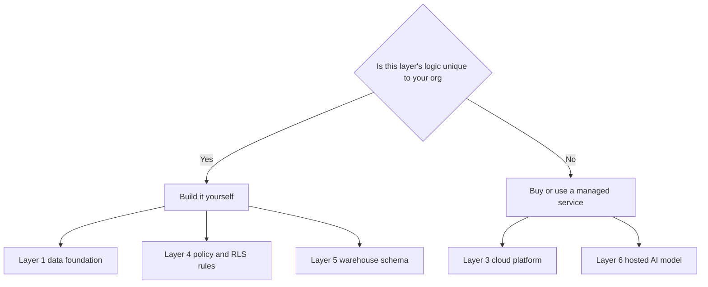

# Putting the System Together — Composing Data, Process, Integration, Cloud, Security, Analytics, and AI Into One Coherent Architecture

Eleven weeks ago you learned that an information system is people, process, data, and technology working together (Week 1). Every week since has gone deep on one slice of the technology: a schema (Week 3), queries (Week 4), a workflow (Week 5), enterprise data (Week 6), an API (Week 7), a cloud deployment (Week 8), access control (Week 9), a dashboard (Week 10), an AI feature (Week 11). Each slice, on its own, is a component. None of them, alone, is a system.

This lecture is about the seam between the slices — the part nobody hands you a template for. A real information system is not eight components sitting next to each other; it's eight components that constrain, depend on, and sometimes fight each other. Get the seams wrong and you ship eight working parts that don't work together. This lecture teaches you to see the whole shape before you touch a single line of SQL for your capstone.

## 1. The layer stack, and why order matters

Think of a complete intelligent system as six layers, stacked bottom to top. Each layer depends on the one below it being right first.

```
┌─────────────────────────────────────────────┐
│  6. AI / Decision support                    │  ← Week 11
│     predictions, recommendations, copilots   │
├─────────────────────────────────────────────┤
│  5. Analytics / BI                           │  ← Week 10
│     warehouse, KPIs, dashboards              │
├─────────────────────────────────────────────┤
│  4. Security & governance                    │  ← Week 9
│     authN/authZ, RLS, privacy, retention     │
├─────────────────────────────────────────────┤
│  3. Cloud & deployment                       │  ← Week 8
│     hosting, scaling, availability           │
├─────────────────────────────────────────────┤
│  2. Integration & process                    │  ← Weeks 5, 7
│     APIs, ETL, workflow automation           │
├─────────────────────────────────────────────┤
│  1. Data foundation                          │  ← Weeks 2, 3, 4, 6
│     requirements → schema → queries          │
└─────────────────────────────────────────────┘
```

Notice the direction of dependency: **you cannot build layer 6 on a broken layer 1.** An AI feature trained on a poorly normalized, ungoverned, unsecured schema will confidently produce wrong answers faster than a human would have. A dashboard (layer 5) built before access control (layer 4) exists will, for a while, show finance data to a sales rep. This is why the course taught the layers bottom-up, and it is why your capstone design document should be organized bottom-up too — even though you'll *present* it top-down (Lecture 3 covers that inversion).

The most common capstone mistake is skipping straight to layer 6 — "we'll add an AI chatbot" — without a settled layer 1. A system without a normalized data foundation cannot be trusted at any layer above it. If your organization's data model is still a guess, that guess is now the ceiling on everything else you design this week.

## 2. Composing the layers: a worked example (Crunch Cycles, extended)

Across Weeks 3–9 you built pieces of **Crunch Cycles**, a fictional online bike retailer: a normalized schema (`regions`, `employees`, `customers`, `products`, `orders`, `order_items`), a Flask REST API, a cloud deployment, RBAC + row-level security, and — in Weeks 10 and 11 — a BI warehouse and an AI feature. Here is how those pieces compose into one system, read left to right as data actually flows:

```
 Customer / Sales rep
        │  (web + mobile clients)
        ▼
 ┌─────────────────────────┐
 │  Flask REST API          │  layer 2/3 — Week 7 endpoints,
 │  (gunicorn, containerized)│  Week 8 deployment, autoscaled
 └───────────┬───────────────┘
             │  writes, JWT-authenticated
             ▼
 ┌─────────────────────────┐
 │  PostgreSQL (OLTP)       │  layer 1/4 — normalized schema
 │  RLS + RBAC enforced     │  (Week 3), roles (Week 9)
 └───────────┬───────────────┘
             │  nightly ETL (Week 10 pipeline)
             ▼
 ┌─────────────────────────┐
 │  Warehouse (star schema) │  layer 5 — fact_orders,
 │  dim_customer, dim_time…│  dim tables (Week 10)
 └───────────┬───────────────┘
      ┌──────┴───────┐
      ▼               ▼
 ┌─────────┐   ┌──────────────────┐
 │ BI       │   │ AI feature        │  layer 5/6 — Week 10
 │ dashboard│   │ (churn model /    │  dashboard, Week 11
 │          │   │  recommender)     │  model, served via API
 └─────────┘   └──────────────────┘
```

Three things to notice, because your capstone will need the same three things:

1. **The AI feature does not query the OLTP database directly.** It trains against the warehouse (or a feature store built from it), and it serves predictions back through the same API layer, under the same auth rules as everything else. This keeps the transactional database fast and keeps one security boundary, not two.
2. **The ETL job is the seam between layers 1 and 5.** It's a piece of Week 5/7 process automation (a scheduled Python job), not a manual export. If someone has to remember to run it, it will eventually not get run.
3. **RLS from Week 9 doesn't stop at the API.** A sales rep querying the dashboard should see the same row-level restrictions they'd hit calling the API directly — otherwise the BI layer becomes a backdoor around the access control you built in Week 9.

## 3. The seams that break real systems

Four integration seams cause almost every "the parts all work but the system doesn't" failure. Check each one explicitly in your capstone design.

**Seam 1 — Data contract drift.** The OLTP schema and the warehouse schema are two different shapes of the same truth. If someone adds a column to `orders` in production and nobody updates the ETL job or the warehouse's `fact_orders`, the dashboard silently goes stale or errors. **Fix:** version your ETL against the schema (Week 5/7 pattern — a migration script that updates both, or a schema-diff check in CI).

**Seam 2 — Security boundary duplication.** Week 9 taught you RLS at the database and RBAC at the API. A new layer (the dashboard, the AI feature) is tempting to wire up with its own, separate check — a `if role == 'admin'` scattered in a notebook. Two independent copies of the same rule *will* drift apart. **Fix:** enforce access control in exactly one place per data path (ideally the database via RLS), and have every consumer — API, dashboard, model-serving endpoint — go through that path.

**Seam 3 — Batch vs. real-time mismatch.** Your warehouse refreshes nightly (Week 10); your AI feature promises a "live" recommendation. If the AI feature reads warehouse data that's 18 hours stale and the product copy says "real-time," you've made a promise the architecture can't keep. **Fix:** state your system's actual latency budget for each feature, explicitly, in the design doc (Lecture 2 covers this as part of non-functional requirements).

**Seam 4 — Cost blind spots at the boundary.** Cloud cost (Week 8) is easy to estimate for the database and the API; it's easy to forget for the ETL job's compute, the warehouse's storage growth, and the AI model's inference cost per call. A system that's affordable at layer 1–4 and unaffordable at layer 5–6 is not actually deliverable. **Fix:** cost every layer, not just the ones you built first (Lecture 2, cost worksheet).

## 4. A composition checklist for your capstone

Before you draw a single box in Exercise 2's architecture diagram, answer these for **your** organization's system, in writing:

| Question | Layer(s) it touches | Why it matters |
|---|---|---|
| What is the single source of truth for each entity? | 1 | Prevents two systems disagreeing about the same customer |
| Which processes are automated vs. still manual? | 2 | Manual steps are where data goes stale or wrong |
| What is deployed where, and how does it scale under load? | 3 | Determines availability and cost |
| Who can see and change what, enforced where? | 4 | One rule, one place, applied everywhere |
| What decisions does the dashboard need to support, and how fresh must the data be? | 5 | Sets your ETL cadence and warehouse design |
| What decision does the AI feature actually improve, and what happens when it's wrong? | 6 | Determines whether AI belongs in this system at all |

If you can't answer one of these rows yet, that's not a failure — it's exactly what Exercise 1 (scoping) and Exercise 2 (architecture) exist to force you to find out, on paper, before you build.

## 5. Build vs. buy, decided layer by layer

Not every layer should be custom-built. Real organizations mix build and buy, and a capstone that pretends everything must be hand-coded in Flask is unrealistic. Decide per layer:

- **Data foundation (1):** almost always build — your schema is *specific* to your organization's rules. A generic product can't encode your business logic.
- **Integration/process (2):** buy or use managed tools when the integration is generic (payment processing, email delivery, calendar sync — use Stripe, SendGrid, Google Calendar API); build when the workflow is your organization's unique process.
- **Cloud & deployment (3):** almost always buy the platform (a managed Postgres, a PaaS like Render/Fly.io/Railway, or IaaS like AWS) — nobody in a 12-week course, or a real small organization, should be racking physical servers.
- **Security & governance (4):** buy the primitives (managed auth like Auth0/Supabase Auth is reasonable for a small system), build the *policy* (roles, RLS rules, retention schedule) — the policy is what's specific to you.
- **Analytics (5):** build the warehouse schema (it must match your data), but consider a managed BI tool (Metabase, a free/open-source option) over hand-rolling dashboard rendering.
- **AI (6):** buy the model (an API call to a hosted LLM or a scikit-learn model you train yourself is "build," but you're not training a foundation model from scratch), build the integration and the guardrails around it.

The rule of thumb that survives contact with a real budget: **build what encodes your organization's unique logic; buy what's a solved, generic problem.** State this decision, layer by layer, in your capstone — Lecture 2 turns this into a cost comparison.


*Deciding build versus buy, layer by layer, using the uniqueness test.*

## 6. What "coherent" actually means

A system is coherent when a stranger — an auditor, a new hire, a hostile reviewer in Challenge 1 — can trace one customer record from data entry through to a decision made about that customer, without hitting an unexplained gap, an inconsistent security rule, or a "and then someone exports a CSV" step. That traceability is the real deliverable of this lecture. Exercise 2 asks you to draw exactly that trace for your own organization: one arrow-by-arrow diagram, from the person entering data to the AI feature (or dashboard) that uses it, with every layer and every seam labeled.

## Key takeaways

- Layers depend on the ones below them; a broken data foundation breaks everything built on top of it.
- Draw your system as a flow, not a list of components — the seams are where real systems fail.
- Check four seams explicitly: schema drift, duplicated security rules, batch/real-time mismatches, and cost blind spots at the edges.
- Decide build vs. buy per layer, not once for the whole system — build what's unique to your organization, buy what's a solved problem.
- Coherence means someone else can trace one record through your whole system without hitting an unexplained gap.

Next: [Lecture 2 — IT Strategy & Delivery](./02-it-strategy-and-delivery.md), where this composed architecture gets phased, costed, and aligned to why the organization needs it at all.
