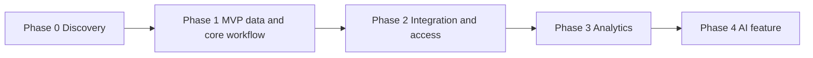

# IT Strategy & Delivery — Aligning the System to Business Strategy, Phasing Delivery, Managing Risk, and Total Cost of Ownership

A perfectly designed architecture that nobody can afford, that takes eighteen months when the organization needs something in six weeks, or that solves a problem the organization doesn't actually have, is a failed project — no matter how clean the schema is. This lecture is about the part of systems work that has nothing to do with SQL: deciding *whether* to build, *what order* to build it in, *what it costs*, and *what could go wrong*. This is IT strategy, and for your capstone it is graded as heavily as the architecture itself.

## 1. Strategy first: does this system serve the business, or just exist?

Every system exists to make an organization better at something specific: cheaper operations, faster decisions, fewer errors, new revenue, better compliance. Before you design anything, write one sentence of the form:

> "This system helps [organization] do [specific thing] better by [specific mechanism]."

For Crunch Cycles's Weeks 3–11 build, that sentence is: *"This system helps Crunch Cycles retain customers better by giving sales reps a live view of order history and an early-warning churn score, instead of a weekly manual spreadsheet export."* Notice what that sentence forces: a defined audience (sales reps), a defined current pain (weekly manual export), and a measurable improvement (live, plus a churn score). If you can't write that sentence for your capstone organization, you don't have a system yet — you have a technology wish list, and Exercise 1 (scoping) is where you fix that before touching Exercise 2's diagram.

**Strategic alignment has a test:** for every layer in your architecture (Lecture 1's six layers), ask "does this layer serve the one-sentence goal, or did I add it because it was fun to build?" An AI feature that doesn't serve the stated goal is scope creep, even if it's technically impressive. This is the single most common reason real IT projects overrun: the system grows features that serve *the builder's* interests, not the organization's.

## 2. Phased delivery: MVP, then increments

No real system ships as one big-bang release — and a system designed to require one is already a strategic risk (if it fails partway, you have nothing). Instead, phase delivery so that each phase is independently valuable, in the order that reduces the *most* risk *soonest*.

A workable phasing pattern, mapped onto this course's own layer stack:

| Phase | What ships | Why this order |
|---|---|---|
| **0 — Discovery** | Requirements doc, ER diagram, stakeholder sign-off | Cheapest phase to be wrong in; get it wrong here, not in code |
| **1 — MVP data + core workflow** | Schema live, one or two critical workflows automated (manual data entry replaced) | Delivers immediate operational value; proves the data model survives contact with real data |
| **2 — Integration + access** | API, RBAC/RLS, deployed to the cloud | Makes the MVP usable by more than one person safely |
| **3 — Analytics** | Warehouse + dashboard for the KPI that matters most | First payoff the organization can *see*, not just use |
| **4 — AI feature** | The one AI feature tied to the strategic goal | Highest risk, highest payoff — shipped last, on a proven foundation |

Two rules make this phasing real, not just a diagram:

- **Each phase must be independently useful.** If Phase 3 fails or gets cut for budget, Phases 0–2 still work and still deliver value. A phased plan where phase 4 is required for phase 1 to matter isn't actually phased — it's one big project cut into slides.
- **Phase order follows risk, not preference.** AI is last not because it's least important, but because it's the least certain to work and the most dependent on everything below it being solid (Lecture 1). Shipping it first means betting the whole project on the riskiest, least-proven part.


*Each phase ships independent value, in order of decreasing certainty.*

## 3. Total cost of ownership (TCO) — not just build cost

The build cost is the part everyone estimates. The part that sinks budgets is what happens *after* launch: hosting, maintenance, support, and the slow tax of technical debt. Model TCO explicitly, in three buckets, using Python — never a spreadsheet, per this course's data rule, because a cost model with formulas is exactly the kind of thing that should be reproducible code, not a fragile cell reference.

```python
# tco_model.py — total cost of ownership over a 3-year horizon
# Run with: python3 tco_model.py

def tco(build_hours, hourly_rate, monthly_cloud, monthly_support_hours,
        years=3, annual_growth_pct=0.15):
    """
    build_hours            : one-time engineering hours to build the system
    hourly_rate             : blended cost per engineering hour (loaded, incl. overhead)
    monthly_cloud            : starting monthly cloud/hosting/API bill
    monthly_support_hours   : ongoing hours/month for bugfixes, small features, on-call
    annual_growth_pct        : how much cloud cost grows per year as usage grows
    """
    build_cost = build_hours * hourly_rate
    months = years * 12
    cloud_total = 0.0
    monthly_bill = monthly_cloud
    for month in range(months):
        if month > 0 and month % 12 == 0:
            monthly_bill *= (1 + annual_growth_pct)
        cloud_total += monthly_bill
    support_total = monthly_support_hours * hourly_rate * months
    total = build_cost + cloud_total + support_total
    return {
        "build_cost": round(build_cost, 2),
        "cloud_total_3yr": round(cloud_total, 2),
        "support_total_3yr": round(support_total, 2),
        "tco_3yr": round(total, 2),
        "tco_monthly_avg": round(total / months, 2),
    }

result = tco(
    build_hours=480,             # ~3 months, 1 engineer, part-time-equivalent
    hourly_rate=65,               # blended contractor/employee rate
    monthly_cloud=45,             # small managed Postgres + PaaS hosting + LLM API calls
    monthly_support_hours=6,      # ~1.5 hrs/week ongoing
)
for k, v in result.items():
    print(f"{k:20s}: {v:,}")
```

Running this prints a build cost, a 3-year cloud total (with growth), a 3-year support total, and the full TCO. Notice what it reveals that a build-cost-only estimate hides: **for a small system, the 3-year support and hosting cost often exceeds the initial build cost.** That's the number a stakeholder actually needs to approve a budget, and it's the number Exercise 3 asks you to produce for your own capstone system.

Three TCO categories every capstone must estimate, in this Python model or one shaped like it:

- **Build (one-time):** engineering hours × rate, for every phase in your delivery plan.
- **Run (recurring):** cloud hosting, managed database, any paid API (including AI model calls — these are usage-metered and easy to underestimate), domain/SSL, backups.
- **Maintain (recurring, people):** bug fixes, security patching, the "someone has to own this" hours. A system with no named owner after launch is a system that silently rots — this is the most commonly skipped line item in student and real-world estimates alike.

## 4. Risk management: name it before it happens

Every system has risks. The difference between a mature IT strategy and a naive one is not the absence of risk — it's whether the risks were named, ranked, and given a response *before* launch, rather than discovered live. Build a risk register as a table, ranked by **likelihood × impact**:

| Risk | Likelihood | Impact | Mitigation | Owner |
|---|---|---|---|---|
| Data migration from legacy spreadsheet loses records | Medium | High | Dry-run migration into a staging DB; row-count + checksum validation before cutover | You (Phase 1) |
| AI feature (Week 11 pattern) gives confidently wrong predictions | High | Medium | Human-in-the-loop review for any AI output above a defined stakes threshold (Week 11's own rule) | Feature owner |
| Cloud bill grows faster than modeled | Medium | Medium | Monthly cost alert at 120% of the TCO model's projection; revisit reserved-capacity pricing at that trigger | Whoever owns Phase 2 |
| Single point of failure: only one person understands the deployment | High | High | Runbook document + a second person walks through a deploy before launch | Team lead |
| Regulatory/privacy requirement missed (Week 9 pattern) | Low | Very High | Governance policy reviewed against Week 9's checklist before any real personal data loads | You (Phase 0) |

Rank by likelihood × impact, and mitigate the top three before spending more design time on anything else — a beautiful architecture with an unmitigated high/high risk is not ready to defend, and Challenge 1 will specifically probe for exactly this gap.

## 5. Aligning to organizational strategy, not just technical correctness

A system can be technically correct and strategically wrong. Ask these before finalizing your capstone's scope:

- **Does this match the organization's actual size and maturity?** A five-person nonprofit does not need a Kubernetes cluster (Week 8 taught you IaaS/PaaS/SaaS trade-offs precisely so you can make this call correctly — most small organizations belong on PaaS or SaaS, not raw IaaS).
- **Does the AI feature (Week 11) solve a real decision, or is it decoration?** "We added a chatbot" is not a strategy; "reps get a churn score that changes which accounts they call first" is.
- **Is the org ready to *operate* this, not just receive it?** A system that requires a data engineer to keep running, handed to an organization with no technical staff, is a strategy failure even if the code is flawless. Your delivery plan (Exercise 3) must include a plan for who runs this after you're gone.

## Key takeaways

- Write the one-sentence strategic purpose before designing anything; every layer must serve it or get cut.
- Phase delivery so each phase ships independent value, ordered by risk — ship the least-certain, highest-payoff layer (AI) last, on a proven foundation.
- Model total cost of ownership in Python across build, run, and maintain — the 3-year run/maintain cost is often bigger than the build cost, and it's the number that gets a real budget approved or rejected.
- Build a ranked risk register before you defend the design; unmitigated high-likelihood/high-impact risks are the first thing a hostile reviewer will find.
- Match the system's complexity to the organization's actual size, budget, and technical maturity — correctness isn't enough if the org can't operate what you hand them.

Next: [Lecture 3 — Presenting & Defending a Design](./03-presenting-and-defending-a-design.md), where this strategy and the architecture from Lecture 1 become a story you tell — and defend — out loud.
