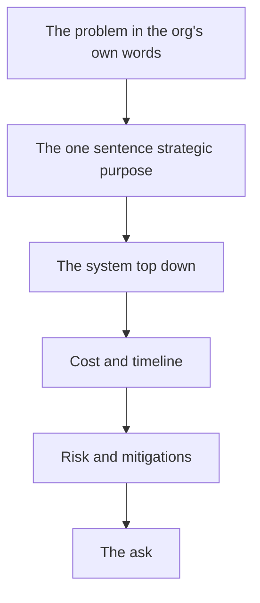

# Presenting & Defending a Design — Communicating Architecture and Trade-offs to Stakeholders and Defending Decisions Under Real Scrutiny

You can build the most coherent, well-costed, risk-managed system in the world and still lose the room in the first two minutes if you present it wrong. This lecture is the one skill this entire course has been building toward without naming it: turning eleven weeks of technical work into a story a non-technical stakeholder can follow, trust, and approve — and then holding your ground when someone pushes back. This is not a soft skill bolted onto the technical work; it is the deliverable. An unpresented system is an unfunded system.

## 1. Know your audience before you build your slides

The single biggest presentation mistake is giving the same talk to every audience. A capstone defense (and a real IT proposal) usually has three different audiences in the room at once, and they want three different things:

| Audience | What they actually want to hear | What bores or loses them |
|---|---|---|
| **Executive / budget owner** | Cost, timeline, risk, business outcome — in that order | Schema diagrams, API endpoint lists, library version numbers |
| **Technical stakeholder / IT lead** | Architecture correctness, security model, how it integrates with what already exists | Vague claims like "it's scalable" with no numbers behind them |
| **End user / operational staff** | What changes for *them*, day one — what gets easier, what they need to learn | Cloud provider comparisons, cost models, org strategy |

You cannot serve all three with one slide deck read in one order. The fix: **lead with the layer each audience cares about, and have the rest ready as backup.** For a mixed-audience defense (which is what Challenge 1 simulates), open with the one-sentence strategic purpose from Lecture 2 — every audience needs that sentence — then let questions pull you into the layer the asker cares about.

## 2. Structure: top-down for presenting, bottom-up for building

Lecture 1 told you to design bottom-up (data foundation first, AI last) because that's the order of dependency. Presenting in that order is a mistake — nobody wants to hear about your `CREATE TABLE` statements before they know why the system exists. Invert it for the room:

1. **The problem, in the organization's own words.** Not "we need a database" — "reps currently export a spreadsheet every Monday and it's already stale by Wednesday."
2. **The one-sentence strategic purpose** (from Lecture 2).
3. **The system, top-down.** Start at the AI/analytics layer the audience will actually see and use, then drop down only as far as the question requires: "here's the dashboard → it's powered by a nightly pipeline → which reads from a secured, normalized database."
4. **Cost and timeline** — the phased plan from Lecture 2, with the TCO number, not just the build estimate.
5. **Risk and what you did about it** — your top three risks and their mitigations, stated plainly. Naming your own risks before someone else does is the single most credibility-building move in a defense.
6. **The ask** — what you need from this audience (budget approval, a data-sharing agreement, sign-off to proceed to the next phase).

This is the structure Exercise 2's diagram and Exercise 3's delivery plan feed directly into — you are not writing a new document for the defense, you are re-ordering the ones you already built.


*Present top down even though the system was designed bottom up.*

## 3. Diagrams that survive a real room

A good architecture diagram (Exercise 2) does three things a bad one doesn't:

- **It has a clear entry point and a clear direction of flow.** A reader should be able to put their finger on "where does data come from" and trace it to "and what decision does it eventually produce," left to right or top to bottom, without doubling back.
- **It names the boxes with nouns a stakeholder recognizes**, not implementation jargon. "Customer order history" reads better in a stakeholder-facing diagram than "orders JOIN order_items JOIN products." Keep the jargon version for the technical appendix; keep the noun version for the slide.
- **It shows the security and cost boundaries explicitly**, because those are the two things every audience in section 1's table cares about in some form. A dotted box around "everything in the cloud, $X/month" and a lock icon on "everything behind auth" answers two audiences' first questions before they ask.

Avoid the two failure modes: too much detail (every column of every table, which drowns the story) and too little (three boxes and an arrow labeled "magic," which invites — correctly — the question "how, exactly?").

## 4. Defending trade-offs: the four-part answer

Every real defense includes a challenge to a decision you made. ("Why Postgres and not a NoSQL store?" "Why build the AI feature in-house instead of buying a SaaS tool?" "Why phase 4 and not phase 1?") The weak response is defensiveness or a shrug. The strong response has four parts, every time:

1. **State the decision plainly.** "We chose to build a custom churn model rather than buy a third-party customer-success platform."
2. **State the alternative you rejected**, honestly — not a strawman. "The alternative was a SaaS tool like [category], which would have been faster to stand up."
3. **State the actual trade-off**, in the terms that matter to *this* audience. "It would cost roughly $X/month recurring and wouldn't have access to our order-level data without an extra integration; our own model uses data we already collect and costs closer to $Y one-time plus minimal inference cost."
4. **State what would change your mind.** "If we had 10x the customer base or no engineering capacity at all, the SaaS tool would be the right call — we're neither of those today."

That fourth part is the one almost everyone skips, and it's the one that most convinces a skeptical reviewer you actually understand the trade-off rather than having picked a side and rationalized it. Challenge 1 (Defend Under Pressure) is built specifically to test whether you can produce this four-part answer live, under a reviewer deliberately trying to rattle you.

## 5. Handling the question you can't answer

You will be asked something you don't know. Real IT defenses always include at least one question outside the presenter's preparation. The unprofessional response is bluffing an answer. The professional response has a script:

> "I don't have that number in front of me — my estimate is [rough bound], and I'll confirm and follow up by [specific time]. Here's how I'd find out: [the actual method — e.g., 'I'd profile the query under the current data volume before promising a latency number']."

This response does three things a bluff can't: it's honest (protects your credibility for every *other* answer you give), it's still useful (a rough bound beats silence), and it shows method (proves you know *how* to get the real answer, which is what a senior stakeholder is actually testing for). Practice this exact phrasing before your defense — it should not be the first time you say it out loud.

## 6. Written defense: the one-page executive summary

Every capstone defense should be backed by a document a stakeholder can read in five minutes without you in the room — because real decisions get made after you leave, when someone forwards your document to a person who wasn't at the meeting. Structure it as:

```
CRUNCH [ORG NAME] — INTELLIGENT SYSTEM PROPOSAL
================================================
Problem (2-3 sentences, in the org's own words)
Proposed system (1 sentence — the strategic purpose)
What it costs (build + 3-year TCO, one number each)
What it delivers, by phase (table: phase, timeline, value)
Top 3 risks and mitigations (table)
The ask (what you need approved, and by when)
================================================
Appendix: architecture diagram, data model, security model
```

This is exactly the artifact the mini-project asks you to produce, and it is the artifact real IT proposals live or die by — not the slide deck, which nobody rereads, but the one page that gets forwarded.

## Key takeaways

- Different audiences want different things first — executives want cost/risk/outcome, technical stakeholders want architecture correctness, end users want "what changes for me."
- Present top-down (problem → purpose → system → cost → risk → ask) even though you designed bottom-up — nobody wants schema before strategy.
- A good diagram has a clear direction of flow, stakeholder-readable labels, and explicit security/cost boundaries.
- Defend every trade-off in four parts: the decision, the honest alternative, the real trade-off in the audience's terms, and what would change your mind.
- When you don't know an answer, give a bounded estimate, a follow-up commitment, and your method — never a bluff.
- Back every defense with a one-page written summary that survives being forwarded without you in the room.

Next: put all three lectures to work — [Exercise 1 — Scope the capstone organization and system](../exercises/exercise-01-scope-the-capstone.md).
